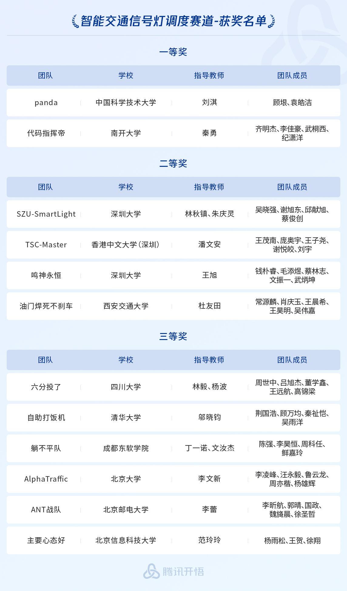

<!--
 * @Author: WANG Maonan
 * @Date: 2023-08-23 17:15:09
 * @Description: All notable changes to this project.
 * @LastEditTime: 2025-12-31 13:07:31
-->
# Change Log

All notable changes to this project will be documented in this file. 
All text added must be human-readable. 
Copy and pasting the git commit messages is **NOT** enough. 

## [Unreleased] - XXXX-XX-XX
### Added
### Changed
### Deprecated
### Fixed
### Removed
### Security

<!-- v1.5 -->
## [v1.5] - 2025-07-16

### Changed

1. Added support for both `low-poly` and `high-poly` vehicle models. Low-poly models can significantly improve rendering speed.
2. In Blender rendering, vehicles are now loaded only when they are near intersections, enhancing rendering performance.
3. Vehicle models can share weights during rendering, further optimizing rendering efficiency.
4. Introduced special intersection events, including trees, and roadblocks, with support for various specific scenarios.

<!-- v1.4 -->
## [v1.4] - 2025-07-16

### Added
1. Exposed real-time vehicle coordinates via `tshub3d` for Blender rendering pipeline.
2. Special vehicle/event generation support (e.g., traffic congestion) through config files.
```python
SCENARIO_CONFIGS = {
    "Hongkong_YMT_NORMAL": {
        # ================== Base Scenario Parameters ==================
        "SCENARIO_NAME": "Hongkong_YMT",  # Scenario directory name
        "SUMOCFG": "ymt_normal.sumocfg",  # Combines route & network configs
        "NETFILE": "./env_normal/YMT.net.xml",  # Network file for map data
        "JUNCTION_NAME": "J1",
        "NUM_SECONDS": 500,
        "PHASE_NUMBER": 3,  # Number of traffic light phases
        "MOVEMENT_NUMBER": 6, 
        "CENTER_COORDINATES": (172, 201, 60),
        "SENSOR_INDEX_2_PHASE_INDEX": {0: 2, 1: 3, 2: 0, 3: 1},
        
        # ==================== Incident Configuration ====================
        "ACCIDENTS": [
            {
                "id": "accident_01",      # Unique incident identifier
                "depart_time": 20,        # Simulation trigger time (seconds)
                "edge_id": "30658263#0",   # Target road segment ID
                "lane_index": 0,          # Affected lane index
                "position": 99,           # Location on lane (meters), lane_length-1
                "duration": 50,           # Duration (seconds), 0=permanent
            },
            {
                "id": "accident_02",
                "depart_time": 100,
                "edge_id": "30658263#0",
                "lane_index": 1,
                "position": 99,
                "duration": 20,
            },
        ],
        
        # ================== Special Vehicle Configuration ==================
        "SPECIAL_VEHICLES": [
            {
                "id": "ambulance_01",     # Unique vehicle ID
                "type": "emergency",       # Vehicle class
                "depart_time": 10,         # Departure time (sim seconds)
                "route": ["960661806#0", "102640426#0"],  # Path edge sequence
            },
            {
                "id": "police_01",
                "type": "police",
                "depart_time": 100,
                "route": ["102454134#0", "102640432#0"],
            }
        ]
    },
}
```
3. Integrated Blender rendering pipeline with significantly enhanced visual output.
4. Added lane-specific mappings for each traffic light movement phase.

### Changed
1. Refactored route generation to use randomized sampling (replacing overview-based counting) for reliable special vehicle spawning.
2. Updated tripinfo analyzer to output pandas-compatible DataFrames.

### Fixed
1. Deduplicated lane IDs in movement statistics collection.

<!-- v1.3 -->
## [v1.3] - 2025-04-15

### News

- Congratulations! Our paper based on TransSimHub, [A Multi-Agent Rollout Approach for Highway Bottleneck Decongestion in Mixed Autonomy](https://ieeexplore.ieee.org/document/10920050), has been published in the ​**​2024 IEEE 27th International Conference on Intelligent Transportation Systems (ITSC)​**​.
- Currently working at ​**​Shanghai AI Lab​**​ on ​**​VLM + TSC​**​ related research. Expect more frequent updates to TransSimHub in the near future.

### Added
- Added the following features to TLS for sensor configuration:
  - Out road IDs and angles
  - Lanes contained in each road
- In TShub3D, added preset sensor output resolutions: 320P, 480P, 720P, 1080P;
- New customization options in TShub3D:
  - Intersection cameras;
  - Aircraft height settings;
- [Highlight] TShub3D now supports mounting sensors to specified objects for faster simulation;

### Changed
- Updated vehicle types in TShub3D:
  - Added various vehicle types
  - Matched vehicle lengths with SUMO specifications
  - Added new 3D models: Police cars, Ambulances, Fire Engine, Taxi
  - For details, see [TSHub3D Vehicles](./tshub/tshub_env3d/_assets_3d/vehicles/README.md)
- Changed default vehicle color to yellow

### Fixed
- Fixed junction camera positioning in TShub3D to properly face lanes (previously had offset issues)
- Resolved synchronization issues between TShub3D rendering and SUMO information (rendering was lagging behind SUMO)
- Added a new test example for 3D and SUMO synchronization, Single vehicle lane change scenario: [Vehicle Lane Change Example](./examples/tshub_env3d/map_model_merge/)

<!-- v1.2 -->
## [v1.2] - 2024-12-30 - Happy New Year 2025!

**Happy New Year 2025!**

## Added

- Uploaded 10+ real road networks, including those from South Korea, Hong Kong, France, etc., to facilitate future testing. This includes:
  - OpenStreetMap data
  - Network data
  - Route data
  - Additional files: poly, tls, detector
  - Corresponding satellite images

<!-- v1.1 -->
## [v1.1] - 2024-11-24

### News

- Due to my internship at **Nokia Bell Labs**, updates to this project have been slower. However, the repository will continue to be maintained in the future.
- Congratulations! Our two papers based on TransSimHub have been accepted by **IEEE Transactions on Intelligent Transportation Systems**.
    - The first paper discusses RL-based traffic signal control under varying intervention frequencies: [Traffic Signal Cycle Control With Centralized Critic and Decentralized Actors Under Varying Intervention Frequencies](https://ieeexplore.ieee.org/document/10696929)
    - The second paper addresses vehicle platooning coordination in networks: [An Approximate Dynamic Programming Approach to Vehicle Platooning Coordination in Networks](https://ieeexplore.ieee.org/abstract/document/10591414)
- Congratulations to Team **TSC-Master** from CUHKSZ for winning the second prize (fourth place overall) in the 2024 Tencent Kaiwu Global AI Competition under the Intelligent Traffic Signal Scheduling track, competing against 2,038 teams from 388 universities worldwide. [Winners List](https://aiarena.tencent.com/aiarena/zh/match/open-competition-2024?tab=score)

<div align=center>
   
</div>
<p align="center">2024 Tencent Kaiwu Global AI Competition Rankings.</p>

### Added

- Added tests for environment setup and installation verification.
- Introduced a channel model for quick calculations of Path Loss, Shadowing, Received Power, and Signal-to-Noise Ratio (SNR), as well as fast computation of Outage Probability.

### Fixed

- Fixed alignment issues in `plot_multi_reward_curves` where the mean and lower/upper bounds were not aligned.
- Updated the base detector file to prevent multiple occurrences in one direction and multiple lane connections for a single lane.


<!-- v1.0 -->
## [v1.0 🚀] - 2024-07-26

### News

It is indeed a delight to announce the upgraded iteration of TransSimHub (TSHub) to version 1.0. Noteworthy in this rendition is the integration of 3D rendering capabilities, a salient feature enhancing the essence of this edition.

In comparison to Carla:
1. TSHub3D swiftly transmutes sumonet into 3D files.
2. TSHub3D boasts a more streamlined nature, ensuring expeditious rendering.
3. TShub3D excels in user-friendliness, facilitating the effortless addition of various sensor types onto diverse objects within the scene through simple parameter configurations.

### Added

- **Highlight**: Introduction of 3D Visualization
  - Automating the transformation of sumonet into 3D, [sumonet_to_tshub3d.py](./tshub/tshub_env3d/sumonet_to_tshub3d.py) expedites the conversion of SUMO Network to glb format for 3D display.
  - Rendering SUMO environments into 3D, [tshub_env3d.py](./tshub/tshub_env3d/tshub_env3d.py), in conjunction with TSHub, concurrently rendering the sumo simulation information into a 3D scene.
  - For insights into various sensors, the Chinese version can be found [here](https://transsimhub.readthedocs.io/en/latest/locales/zh_CN/tshub3d_sensors/index.html), and the English version [here](https://transsimhub.readthedocs.io/en/latest/locales/en/tshub3d_sensors/index.html).
- Enhanced [base_tls.py](./tshub/traffic_light/tls_type/base_tls.py) by integrating the entry road ID, angle, and position for each intersection.

### Fixed

- Addressed the issue where the multifunctional lanes were unable to acquire data. Previously, this anomaly stemmed from the presence of d multifunctional lanes alongside r, s, l connections, such as rs, which led to erroneous data retrieval.
- Integrated stop line extraction within tls to discern and calculate the coordinates for placing intersection cameras.

### Deprecated

- The abandonment of leveraging render_pipline to enhance rendering effects, with a renewed focus on rendering efficiency.

<!-- v0.9.9 -->
## [v0.9.9] - 2024-07-06

### News

Congratulations! The paper `UniTSA: A Universal Reinforcement Learning Framework for V2X Traffic Signal Control` based on TransSimHub has been accepted by `IEEE Transactions on Vehicular Technology`. This paper mainly discusses the generalization of RL-based TSC tasks.
- Paper link: https://ieeexplore.ieee.org/abstract/document/10535743/
- Code link: https://github.com/wmn7/Universal-Light

### Added

- Updated static data Map:
  - For nodes, added coordinate information and node types (e.g., whether it's a traffic light)
  - In addition to `polygon.py` (lane, edge, and node) in the map, there's also `grid.py`, which contains statistical information within an area (e.g., SNR within a region)
- Added results analysis section:
  - Parse `tripinfo.xml` file to get statistical measures of all indicators.
  - Parse `route.xml` file to get the change in vehicle numbers in each time period.
  - Parse `tls_program.xml` file to get the change in traffic phase duration.
- OSM to SUMO Net:
  - Can convert OSM to Net map.
  - According to the filtered net map, output a new OSM map, retaining only the necessary elements.

### Changed

- Added `__copy_files_with_reset_num` in base_sumo_env to ensure that all output files are copied before reset to prevent overwriting. This makes it easy to analyze sumo output files.
- Modified the tripinfo.out.xml file in base_env to output the fuel consumption and carbon emissions of each vehicle.

### Fixed

- Fixed the issue in plot_reward_curves.py where mean value and std error could not align.
- Modified setup file to install static files, resolving the issue of aircraft visualization lacking textures.


<!-- v0.9.7 -->
## [v0.9.7] - 2024-05-06

The `TSHub` project has been undergoing numerous updates recently, with new features being added and different use cases being organized. Detailed scenario descriptions will be provided in the upcoming **1.0** version.

### Added

- Vehicle Updates
  - Added `lane_position` attribute to the `vehicle` features, which allows for the determination of the current vehicle's distance from the starting point of the lane. This feature can be utilized to divide the lane into cells and calculate vehicle metrics within each cell.
  - In `vehicle`, if the type is `ego`, collision support is now available during control, such as collisions caused by speed ([vehicle_speed_crash.py](./examples/vehicles/vehicle_action/vehicle_speed_crash.py)) or lane changes ([vehicle_laneChange_crash.py](./examples/vehicles/vehicle_action/vehicle_laneChange_crash.py)). Collision settings are completed in [base_vehicle_action.py](./tshub/vehicle/vehicle_type/base_vehicle_action.py).
- Traffic Light UpdatYear: 2023 | Conference Paper | Publisher: IEEE
es
  - Added a new action for traffic light control tasks, `Choose Next Phase (Synchronize)`. This action allows all agents in multi-agent control tasks to act together, preventing interval changes between different agents' actions and facilitating multi-agent training. See example in [tls_choosenextphase_syn.py](./examples/traffic_light/traffic_light_action/tls_choosenextphase_syn.py).
  - Introduced a new action, `Adjust Cycle Durations`, which modifies the duration of each phase of the traffic light in each cycle. This allows RL to control the traffic light less frequently, making the entire system more stable. See example in [tls_adjustCycleDuration.py](./examples/traffic_light/traffic_light_action/tls_adjustCycleDuration.py).
- Map Updates
  - Added attributes to `map`, now the map can include the edge to which the lane belongs and the length of the lane.
- Scenario Generation
  - `generate_routes.py` now supports the generation of different types of vehicles, such as controlling acceleration parameters. See the generated example in [generate_routes.py](./examples/sumo_tools/generate_routes.py).
- Auxiliary Features
  - Added current simulation time to each step of the simulation environment, allowing users to check if the program is running normally without opening the GUI. [tshub_env.py](./tshub/tshub_env/tshub_env.py)
  - Added route_analysis.py to sumotool to assist in result analysis (including result analysis and visualization). See detailed example in [analysis_route.py](./examples/sumo_tools/analysis_output/analysis_route.py).
  - Added visualization analysis for tls program in sumotool. See detailed example in [analysis_tls_program.py](./examples/sumo_tools/analysis_output/analysis_tls_program.py).

### Changed

- Added tensorboard installation to `setup.py` file for real-time monitoring of training results.
- `init_log.py` file can now set different levels for logs output to the terminal, further refining the previous log_level into file_log_level and terminal_log_level, which can be set independently.
- Added `Fill Outliers` to `plot_reward_curve.py` to handle outliers (usually caused by poor rewards during exploration), and also added support for saving reward curve images.

### Fixed

- Fixed the error of visualization after installing TSHub, `Init.py -> init.py`.
- Fixed vehicle action design
  - Fixed the problem of vehicle lane change direction error, where the direction of lane change is calculated based on the size of the lane index.
  - Fixed the problem where the vehicle did not stay in the current lane when it could not change lanes [base_vehicle_action.py](./tshub/vehicle/vehicle_type/base_vehicle_action.py).

<!-- v0.9.5 -->
## [v0.9.5] - 2023-12-30 - Happy New Year 2024!

**Happy New Year 2024!**

### Added

- Enhanced the `vehicle` environment with new attributes:
  - `accumulated_waiting_time`: Accumulated waiting time of the vehicle.
  - `distance`: Distance traveled by the vehicle.
  - `leader`: Information about the vehicle ahead, including (vehicle id, distance).
  - `width`, `length`, and `heading_angle`: Attributes for visualizing vehicles in the environment.
- Introduced a pedestrian module:
  - Modified the connection judgment in [tls_connections.py](./tshub/sumo_tools/sumo_infos/tls_connections.py#76), excluding pedestrian crossings.
  - Added a testing environment for pedestrians.
  - Included pedestrian state representation.
- Added two new visualization modules in [ENV Render](./examples/tshub_env_render/). Below is a summary of the six rendering methods:

```
TransSimHub Rendering Modes
|
|-- Pixel-based State Output
|   |
|   |-- RGB Rendering Mode
|   |   |
|   |   |-- Global Rendering
|   |   |-- Local Intersection Rendering
|   |   |-- Follow Vehicle Rendering
|   |
|   |-- SUMO-GUI Rendering Mode
|       |
|       |-- Global Rendering
|       |-- Local Intersection Rendering
|       |-- Follow Vehicle Rendering
```

### Changed

- Complemented the `vehicle` section:
  - In feature extraction, added CO2 emissions (mg/s), fuel consumption (mg/s), and speed without traci (returns the speed the vehicle would drive if no speed-influencing command such as `setSpeed` or `slowDown` was given).
  - In control, `lane_change=-1` now uses SUMO's lane-changing strategy, and `speed=-1` uses SUMO's speed strategy.
  - Updated corresponding documentation.
- Updated `LaneWithContinuousSpeedAction` to maintain the original speed when the target speed is set to -1.
- Modified the vehicle speed scenario:
  - Prevented direct lane changes for all vehicles to mitigate queuing at bottlenecks by adjusting speeds.
  - Regenerated road network and traffic flow files. Refer to [Vehicle Speed Scenario](./benchmark/sumo_envs/veh_speed/).
  - Updated [veh_wrapper.py](./benchmark/vehicle/utils/veh_wrapper.py) with `__get_actions` and `__update_actions` methods to generate default actions for all vehicles (speed=-1, lane=0), meaning no lane changes or speed alterations. Subsequent parameters only affect the `speed` of the `ego` vehicle.
- Moved the `highlight` parameter from `control_objects` in `vehicle_builder.py` to `init`, standardizing the `control_objects` method for different `objects`.
- Added a `highlight` parameter in `tshub.py`.

### Fixed

- Corrected installation steps in the documentation, changed `cd TransSimHub.git` to `cd TransSimHub`.

<!-- v0.9 -->
## [v0.9] - 2023-11-02

### Added

- Added environment for vehicle control
  - Introduced [Vehicle Speed Scenario](./benchmark/sumo_envs/veh_speed/), which is accomplished by controlling vehicle speed.
- Added [plot_reward_curves.py](./tshub/utils/plot_reward_curves.py) in utils, for plotting reward curve with standard deviation from log files.
- Added examples of multi-agents for traffic signal control.
  - Introduced environment [Multi-Traffic Signal Control](./benchmark/sumo_envs/multi_junctions_tsc/), which includes $3$ traffic signals.
  - Added multi-traffic signal control environment in `TsHub`, see [Multi-Agent TSC Env](./benchmark/traffic_light/multi_agents/env_utils/).
  - Provided examples of `MAPPO` algorithm, controlling multiple traffic signals. Detailed algorithm can be found at [MAPPO Traffic Signal Control](./benchmark/traffic_light/multi_agents/mappo_models/).
- Added introduction to traffic signal control based on reinforcement learning, [RL for TSC](./benchmark/traffic_light/).

### Changed

- Unified the connection method of `from_edge` and `direction` to `f"{from_edge}--{direction}"`.
- Updated doc description about the new state of traffic light, `fromEdge_toEdge`.
- Updated the rule-based method in single agent to adapt to the new connection method of `from_edge` and `direction`.

<!-- v0.8 -->
## [v0.8] - 2023-09-26

### Added

- Added support for `map` to retrieve properties of different polygons
  - Added `polygon.py` to define the properties of a polygon
  - Added `map_builder.py` to initialize static information in the scene, constructing types and shapes of all polygons based on `*.poly.xml` and `*.osm` files
- Added examples about `map`
  - Created `get_poly_info.py` to retrieve properties of polygons in the map
  - Developed `plot_poly_shape.py` to visualize information in the map
- Introduced a utility function `osm_build.py` to convert from `osm` to `sumo net`
- Documented the process of creating the environment from `osm` to the map used in experiments
  - Export the required area from [openstreetmap](https://www.openstreetmap.org/)
  - Run `osm_build.py` to generate `*.net.xml` and `*.poly.xml`, as demonstrated in the `osm_build.py` example in the `sumo_tools` directory of the `example` folder
  - [Optionally] Add background images
  - Run `generate_detectors.py` to create detectors
  - Run `generate_routes.py` to generate traffic flows
- Modified `tshub` to support the static information `map builder`
  - Added an example `tshub_env_map.py` to demonstrate how to access environment information in `env`


### Changed

- Added `custom_update_cover_radius` to `aircraft.py` to allow users to customize the update of `cover_radius` based on `position` and `communication_range`
  - Updated the default `update_cover_radius` in `aircraft.py` to support parameter input and return `cover_radius`
  - Updated the creation of `aircraft` in `aircraft_builder.py`
  - Added an example `aircraft_custom_update_cover_radius.py` in the `example` folder to illustrate how to customize `custom_update_cover_radius`
- Added `color` to `aircraft.py` to allow users to customize the color of the coverage radius circle

### Fixed

- Modified the addition of polygons in `aircraft.py` to ensure they are displayed in white color without altering the original image colors.

<!-- v0.7 -->
## [v0.7] - 2023-09-22

### Added

- Add "status description," "action design," and "program examples" to the following three objects:
  - `aircraft`, `vehicle`, `traffic lights`
- Add Chinese documentation:
  - TransSimHub scene creation, including signal light output, detector generation, and traffic flow generation
  - TransSimHub Object, introducing the three basic components of `TransSimHub`: aircraft, vehicle, and traffic lights
  - Add examples of scene combinations, integrating the usage of all three components: signal light control scene, aircraft control scene
  - Add an example of using RL to control traffic lights

### Changed

- `traffic_light.py`:
  - Add additional attributes:
    - Add `this_phase_index` in the traffic light data class (int)
    - Add `last_step_vehicle_id_list` in the traffic light data class (List(str)). Through the vehicle ID, we can calculate the waiting time at the intersection.
- `aircraft.py`:
  - Add the `aircraft type` attribute to handle different types of aircraft differently.
  - Set `setLineWidth` to width 3 to optimize the visualization effect of aircraft.
- `traffic_light_builder.py`:
  - Modify `process_detector_data` to support processing list data types and merge them.

### Fixed

- Resolve the issue where `vehicle` cannot retrieve `next_tls` when using `libsumo` [vehicle.py](https://github.com/Traffic-Alpha/TransSimHub/blob/main/tshub/vehicle/vehicle.py#L97).
- In the `aircraft example`, fix the issue where `get_aircraft_state.py` does not pass `sumo` and cannot obtain `aircraft info`.


<!-- v0.6 -->
## [v0.6] - 2023-09-01

### Added

- Added `generate_route.py` module in `sumo_tools` for quickly generating route files for scenarios.
  - `generate_trip.py`: Generates *.trip.xml files based on the number of entering vehicles (veh/min) for each time period. Allows control over the mixture ratio of ego vehicles and background vehicles. The default maximum speed is 17 m/s, equivalent to 61.2 km/h.
  - `generate_turn_def.py`: Generates *.turndefs.xml files based on the turning probabilities for each time period.
  - `interpolation` module: Provides interpolation for smooth changes in flows or turndefs.
- Added `generate_add.py` module in `sumo_tools` for quickly generating add files to monitor changes in traffic signal states.
  - See [SUMO Simulation Output](https://sumo.dlr.de/docs/Simulation/Output/) for possible additional files to add.
- Initialized documentation using Sphinx for writing the documentation.
  - `doc` supports `readthedocs` documentation: [Transsimhub Documentation](https://transsimhub.readthedocs.io/)
  - Wrote the `introduction` section to introduce the TransSimHub repository.
  - Wrote the `installation` section to explain how to install TransSimHub.
- Added `normalization_dict.py` in `utils`, which normalizes the keys in a dictionary to make their sum equal to 1.
- Added `traffic_light_ids.py` in `sumo_tools/sumo_infos` to return the IDs of traffic lights in the network.

### Changed

- Modified `setup.py` to include `extras_require` for additional support for the `doc` environment.
- Updated `init_log.py` to include the function and corresponding line numbers in the log.
- Added a `vehicle type` attribute in `vehicle.py` to differentiate between ego vehicles and background vehicles.

### Fixed

- Updated `dict_to_str` to handle the format of np.array, as it cannot be directly converted. Added type checking and conversion to resolve TypeError: Object of type ndarray is not JSON serializable.
- Fixed the highlighting functionality in `vehicle_builder.py` to avoid highlighting duplicate vehicles.


<!-- v0.5 -->
## [v0.5] - 2023-08-31

### Added

- Added `tshub_env` module
  - `base_sumo_env.py`: Initializes the SUMO simulation environment.
  - `tshub_env.py`: Integrates "Veh" (vehicles), "Air" (aircraft), and "Traf" (traffic lights) for overall control and information retrieval.
- Added `sumo_env` in `example`
  - `single_junction`: Environment for a single junction.
  - `three_junctions`: Environment for three junctions, including ego vehicle and background vehicles.

### Changed

- `aircraft_builder.py`: Separated SUMO initialization from `aircraft_inits` and now pass SUMO once during the builder process.
- Updated a series of utility functions in `utils`
  - `check_folder.py`: Checks if a folder exists and creates it if it doesn't.
  - `format_dict.py`: Formats a dictionary for better display when printing.
  - `nested_dict_conversion.py`: Converts nested dictionaries.
  - `get_abs_path.py`: Converts relative paths to absolute paths.

### Fixed

- Modified the type of `new_position` in `base_aircraft_action.py` from tuple to list to resolve a TypeError: 'tuple' object does not support item assignment.


<!-- v0.4 -->
## [v0.4] - 2023-08-30

### Added

- Added four different aircraft action types:
  - `stationary.py`: The aircraft remains stationary at its initial position.
  - `horizontal_movement.py`: The aircraft can only move horizontally, with eight possible heading angles.
  - `vertical_movement.py`: The aircraft can only move vertically, with three possible heading values: up, stationary, and down.
  - `combined_movement.py`: The aircraft can move both upward and downward simultaneously, combining azimuth and pitch angles. There are a total of 40 combinations.

### Changed

- Added `base_builder.py` to standardize the interface between different builders:
  - `aircraft_builder.py`, `vehicle_builder.py`, `traffic_light_builder.py`
- Provided examples for vehicle, aircraft, and traffic light under the new builder:
  - `traffic_light_action`: `tls_choosenextphase.py` and `tls_nextornot.py`
  - `aircraft_actions`: `aircraft_combined.py`, `aircraft_horizontal.py`, `aircraft_stationary.py`, and `aircraft_vertical.py`
  - `vehicle_action`: `vehicle_lane.py` and `vehicle_lane_with_continuous_speed.py`

### Fixed

- In `traffic_light.py`, set `this_phase` to False before each update in `__update_this_phase()`. Previously, it would cause all `this_phase` values to be True.


<!-- v0.3 -->
## [v0.3] - 2023-08-28

### Added

- Added traffic light module
  - `traffic_light_action_type.py`: Defines two types of traffic light control: "Choose Next Phase" and "Next or Not".
  - `traffic_light.py`: Defines the basic properties and methods of each traffic light.
  - `traffic_light_builder.py`: Initializes all traffic lights in a scene and defines interfaces for accessing information and control.
  - `choose_next_phase.py`: Defines the control method "Choose Next Phase".
  - `next_or_not.py`: Defines the control method "Next or Not".

### Changed

- Modified the vehicle module to no longer create multiple classes for the same vehicle.
  - Added `update_vehicle_feature`, which updates the current information of the vehicle at each step.
  - Added and improved different vehicle action types, including `lane` and `lane with continuous speed`.
  - Added attributes to the vehicle, including `action type` and `lane index`.


<!-- v0.2 -->
## [v0.2] - 2023-08-25

### Added

- Added `generate_detectors.py` file in the `sumo_tools` module
  - `base_detectors.py`: Defines the information retrieval from intersections and the `generate_detector` method.
  - `e1_detectors.py`: Generates e1 detectors placed at a default distance of 2m from the traffic lights.
  - `e2_detectors.py`: Generates e2 detectors with a default length of 100m.
  - `e3_detectors.py`: Generates e3 detectors that cover turns.
- Added `sumo_infos` in the `sumo_tools` module to extract connections of traffic light signals.

### Changed

- Modified `init_log.py` in the `utils` section to store logs in a separate folder.
- Modified `get_abs_path.py` in the `utils` section to include the SIM identifier in the logs.


<!-- v0.1 -->
## [v0.1] - 2023-08-23

### Added

- Initialized the project.
- Vehicle module:
  - Added `vehicle_builder.py` file: Provides methods to retrieve information and control all vehicles in the scene.
  - Added `vehicle.py` file: Defines the `VehicleInfo` class that represents information about a vehicle.
- Aircraft module:
  - Added `aircraft.py` file: Defines the `AircraftInfo` class that represents information about an aircraft.
  - Added `aircraft_builder.py` file: Provides methods to create and control aircraft.

<!-- v0.6 -->
<!-- 添加 uml 框架图 -->
<!-- log 可以设置 level -->
<!-- 环境适配 gym 和 rllib -->

<!-- v0.7 -->
<!-- 添加 feature process 模块 -->