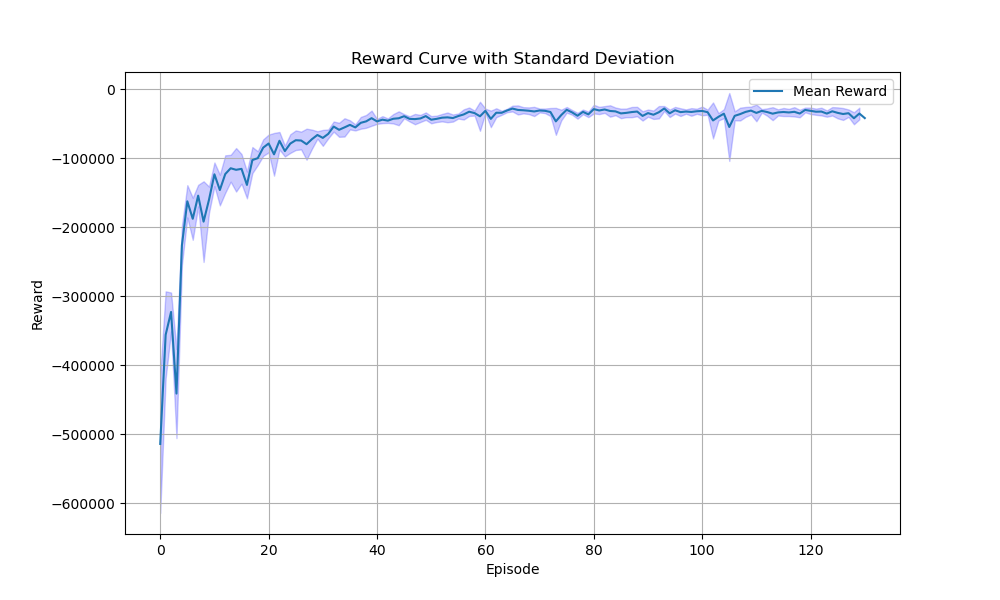
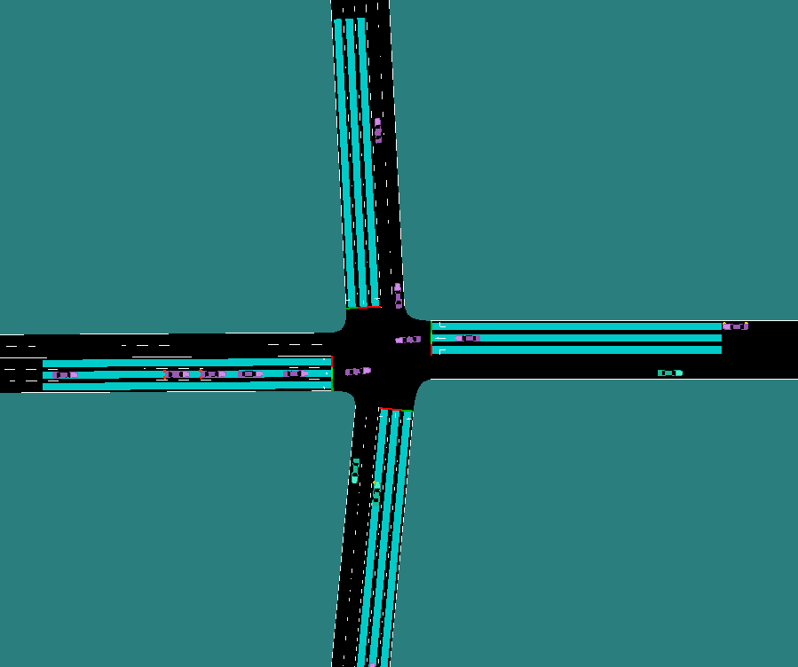
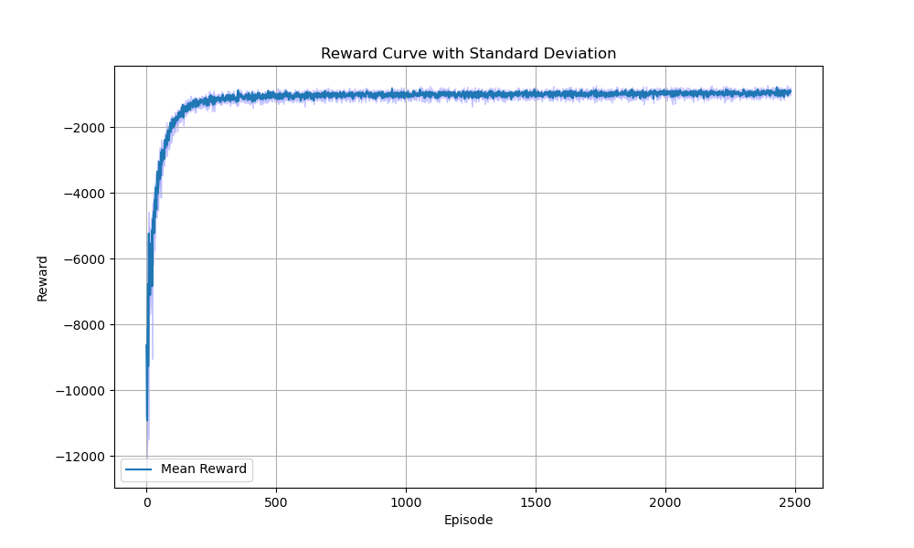
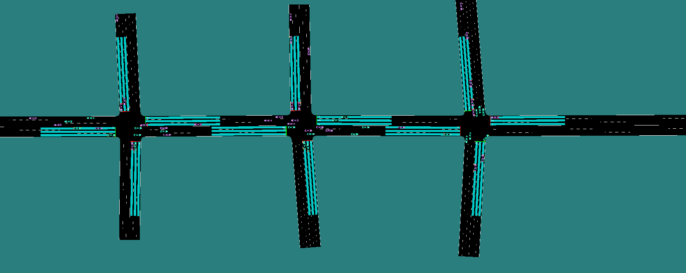

<!--
 * @Author: WANG Maonan
 * @Date: 2023-10-30 23:53:17
 * @Description: Introduction for TSC using TsHub
 * @LastEditTime: 2023-11-01 23:49:58
-->
# TsHub for Traffic Signal Control (TSC) with Reinforcement Learning (RL)

This document presents an example of utilizing `TsHub` in conjunction with reinforcement learning for traffic light control. 

- [TsHub for Traffic Signal Control (TSC) with Reinforcement Learning (RL)](#tshub-for-traffic-signal-control-tsc-with-reinforcement-learning-rl)
  - [Single Agent for TSC](#single-agent-for-tsc)
    - [Environment Construction](#environment-construction)
    - [Model Training](#model-training)
    - [Model Testing](#model-testing)
  - [Multi-Agent Control for TSC](#multi-agent-control-for-tsc)
    - [Environment Construction](#environment-construction-1)
    - [Model Training and Testing](#model-training-and-testing)


## Single Agent for TSC

The demonstration of using `TsHub` to control a single traffic light is located in the [Single Agent for TSC](./single_agent/) directory. The environment used here is the [J1 Junction](../sumo_envs/J1/). The process is divided into **three steps**:
1. Building an environment for single intersection traffic light control;
2. Defining the model structure and training the model;
3. Testing the model (including traditional methods);

### Environment Construction

Initially, we construct an environment for single intersection traffic light control using `TsHub`. In [tsc_env.py](./single_agent/utils/tsc_env.py), we initialize `TshubEnvironment`. As our focus is solely on controlling the traffic lights and calculating the reward based on the waiting time of the vehicles, we set `vehicle_builder` and `traffic_light_builder` to `True` during initialization.

Subsequently, in [tsc_wrapper.py](./single_agent/utils/tsc_wrapper.py), we handle the state and reward. These correspond to `state_wrapper`, `reward_wrapper`, and `info_wrapper`:

```python
def state_wrapper(self, state):
    """Returns the occupancy of each movement at the current moment.
    """
    pass

def reward_wrapper(self, states) -> float:
    """Returns the average queue length at the intersection.
    """
    pass

def info_wrapper(self, infos, occupancy):
    """Adds the occupancy rate of each phase to info.
    """
    pass
```

Lastly, we encapsulate the environment initialization into a function [make_tsc_env.py](./single_agent/utils/make_tsc_env.py) for convenient initialization in the future. Once the environment is constructed, you can execute [check_tsc_env.py](./single_agent/check_tsc_env.py) to verify if the environment meets the expectations.

```shell
python check_tsc_env.py
```

In this environment, the `state`, `action`, and `reward` are defined as follows:
- state: The occupancy rate of each movement at the intersection at each moment, containing information of $5$ moments;
- action: We adopt `Choose Next Phase` as the action type. Given that the [J1 Junction](../sumo_envs/J1/) has $4$ phases in total, the action is `gym.spaces.Discrete(4)`;
- reward: The negative of the waiting time of all vehicles in the road network;

### Model Training

With the environment set up, we can commence the training. Initially, we need to define the model structure. For detailed model structure, refer to [custom_models.py](./single_agent/utils/custom_models.py). Here, we first use `Linear` to perform `Embedding` on the intersection information, then use `LSTM` to encode the time series data.

```python
class CustomModel(BaseFeaturesExtractor):
    def __init__(self, observation_space: gym.Space, features_dim: int = 16):
        """Feature Extract
        """
        super().__init__(observation_space, features_dim)
        net_shape = observation_space.shape[-1] # 12

        self.embedding = nn.Sequential(
            nn.Linear(net_shape, 32),
            nn.ReLU(),
        ) # 5*12 -> 5*32
        
        self.lstm = nn.LSTM(
            input_size=32, hidden_size=64,
            num_layers=1, batch_first=True
        )
        self.relu = nn.ReLU()

        self.output = nn.Sequential(
            nn.Linear(64, 32),
            nn.ReLU(),
            nn.Linear(32, features_dim)
        )

    def forward(self, observations):
        embedding = self.embedding(observations)

        output, (hn, cn) = self.lstm(embedding)
        hn = hn.view(-1, 64)
        hn = self.relu(hn)
        
        output = self.output(hn)
        return output
```

We employ the PPO algorithm from [Stable Baselines3](https://github.com/DLR-RM/stable-baselines3). The complete code is available in [sb3_ppo.py](./single_agent/sb3_ppo.py). The following command can be used to start the training:

```shell
python sb3_ppo.py
```

Post training, the model weights are saved in [models](./single_agent/models/), and the training logs are stored in [tensorboard](./single_agent/tensorboard/) and [log](./single_agent/log/). The `reward curve` is depicted below:

<div align=center>
    
</div>

### Model Testing

For the trained model, you can execute [eval_rl_agent.py](./single_agent/eval_rl_agent.py) to visualize the model's performance. Below is the visualization of the results in [models](./single_agent/models/):


<div align=center>
    
</div>

---

## Multi-Agent Control for TSC

Examples illustrating the control of multiple traffic lights using `TsHub` are located in the [Multi-Agent for TSC](./multi_agents/) directory. Similar to single intersection control, this section will cover the creation of the environment, model training, and model testing.

### Environment Construction

The code for constructing a multi-agent traffic signal control environment is found in the [env_utils](./multi_agents/env_utils/) directory. The call relationship is as follows:

```
tsc_env -> tsc_wrapper -> pz_env -> make_tsc_env
```

In [tsc_env.py](./multi_agents/env_utils/tsc_env.py), we initialize the `TshubEnvironment` environment. Then, in [tsc_wrapper.py](./multi_agents/env_utils/tsc_wrapper.py), we transform it into the desired `state`, `action`, and `reward` format. Subsequently, in [pz_env.py](./multi_agents/env_utils/pz_env.py), we inherit `ParallelEnv` from [Petting Zoo](https://pettingzoo.farama.org/). Finally, in [make_tsc_env.py](./multi_agents/env_utils/make_tsc_env.py), we combine the environments. The following three files are used to test the custom environment:

- [check_pz_env.py](./multi_agents/check_pz_env.py)
- [check_rl_env.py](./multi_agents/check_rl_env.py)
- [check_rl_parallel_env.py](./multi_agents/check_rl_parallel_env.py)

### Model Training and Testing

In this section, we utilize [TorchRL](https://github.com/pytorch/rl) to implement multi-agent reinforcement learning. We employ the `MAPPO` algorithm for training, and the model structure can be found in [make_modules.py](./multi_agents/train_utils/make_modules.py). Execute the following command to start training:

```shell
python train_mappo.py
```

The trained model weights are stored in [mappo_models](./multi_agents/mappo_models/). The log files and `tensorboard` files for training are located in [log](./multi_agents/log/) and [mappo_tensorboard](./multi_agents/mappo_tensorboard/), respectively. The following is the `reward curve` for training:

<div align=center>
    
</div>


Finally, execute [eval_mappo.py](./multi_agents/eval_mappo.py) to visualize the performance of the trained model. The simulation results are depicted in the following figure:

<div align=center>
    
</div>

---