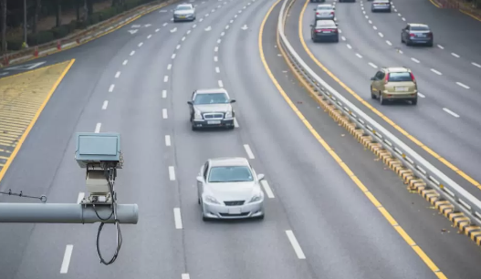
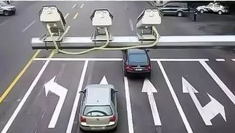
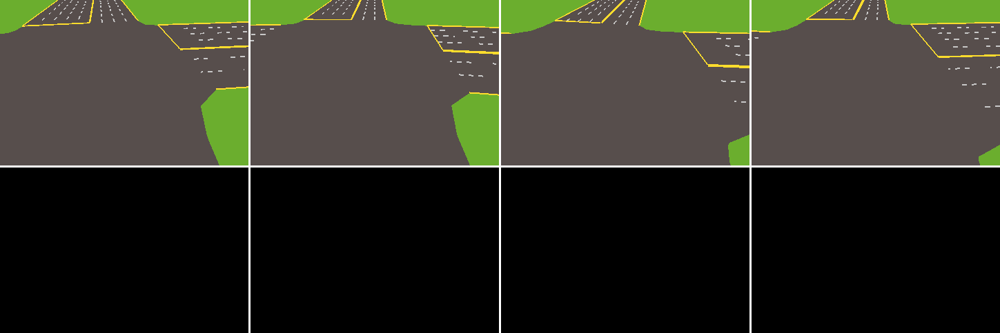

Junction RGB Sensors
=======================

TSHub3D provides a comprehensive monitoring system for crossroads, deploying both **frontal capture** and **rear capture** sensors at every ingress of a junction, thus achieving an all-encompassing surveillance of traffic intersections. Herein is a detailed exposition of the frontal and rear capture sensors, alongside the effects they capture.

Frontal Capture Sensors
----------------------------

Primarily responsible for photographing the front aspect of vehicles, the frontal capture sensors adeptly capture the vehicular frontage and the queueing scenario on lanes. Presented below is an exemplification image from a frontal capture sensor.

   An example of a frontal capture sensor. The image displays the frontage of vehicles and the lane queueing status.

Following this, we observe the dynamic effects captured by TSHub3D's frontal capture sensors. These images can be utilized for traffic monitoring analysis or as labeled data for the training of autonomous driving system models.

.. figure:: ../../../_static/tshub3d_sensors/junction/junction_front.gif
   :alt: Frontal capture sensor effects
   :align: center

   Frontal capture sensor effects. The image showcases scenes and vehicular information captured by frontal capture sensors from four different directions.

Rear Capture Sensors
-----------------------

Conversely, rear capture sensors are tailored towards seizing the rear view of vehicles, which is instrumental in deducing the direction of vehicular movement (forward or turning). Concurrently, these sensors also offer a view of the traffic conditions on the opposite lanes of the junction. Below is an illustrative image of a rear capture sensor.

   An exemplification of the rear capture sensor. The image depicts the rear view of a vehicle and the queuing status on the opposite lanes of the intersection.

The dynamic imagery below displays the capture effects within TSHub3D by the rear capture sensors. Similar to the frontal capture sensors, the rear ones also extend a panoramic monitoring perspective.

   Rear capture sensor effects. The image illustrates the complete scenes and vehicular information captured by rear capture sensors from four different directions.

By amalgamating the frontal and rear capture sensors, TSHub3D is capable of providing an all-inclusive traffic monitoring solution for junctions, pivotal for traffic flow analysis, accident prevention, and the development of autonomous driving algorithms.