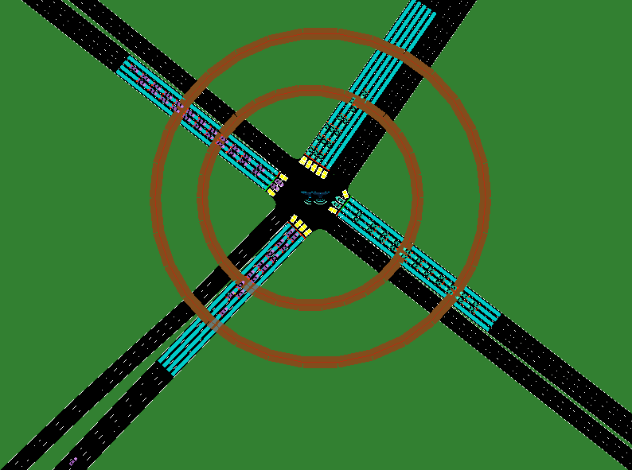

TransSimHub 3D Rendering
===========================

Within this segment, we shall elucidate the process of employing TransSimHub (TSHub) for the generation and rendering of a three-dimensional traffic simulation scene. Our exemplar scenario encompasses a **standard, singular intersection**, inclusive of:

* Three autonomous driving vehicles (ego vehicles);
* Two aircraft: one capable of vertical flight and another dedicated to horizontal navigation.

SUMO Visualization
--------------------

Initially, we utilize SUMO to delineate the traffic flow at the intersection. As illustrated below, one can observe the vehicular movement within the junction, alongside two drones executing aerial tasks above it. 

.. note:: 
   Notably, the drone engaged in horizontal flight maintains a constant communication radius, whereas its counterpart, the vertically navigating drone, adjusts its communicative reach in accordance with altitude variation.

   SUMO simulation effect image. The image showcases vehicular transit at the junction and the flight status of the drones.

TSHub3D Visualization
----------------------

Subsequently, we advance to **TSHub 3D** for three-dimensional visualization. TSHub 3D facilitates the strategic placement of sensors throughout the scenario to capture visual effects from diverse angles. As depicted below, we station sensors above the intersection and render around it to attain a more vivid and authentic three-dimensional visual experience.

.. figure:: ../../../_static/tshub3d_sensors/traffic_scenario/tshub3d.gif
   :alt: TSHub3D visualization effect image
   :align: center
   :figwidth: 76%

   TSHub3D visualization effect image. The image displays the three-dimensional scene captured by the sensors, including lanes, lane markings, and vehicular presence at the intersection.

In the visualizations mentioned, we can distinctly perceive the position of each vehicle and their dynamic interactions within the simulated environment. The functionalities of TSHub 3D are imperative for traffic research and the development of autonomous driving systems, offering a potent tool for 3D demonstrations of traffic scenarios.