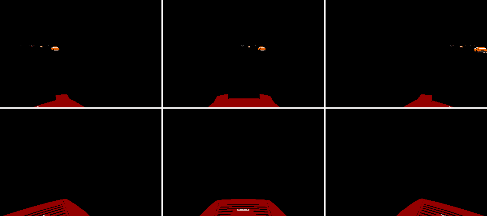
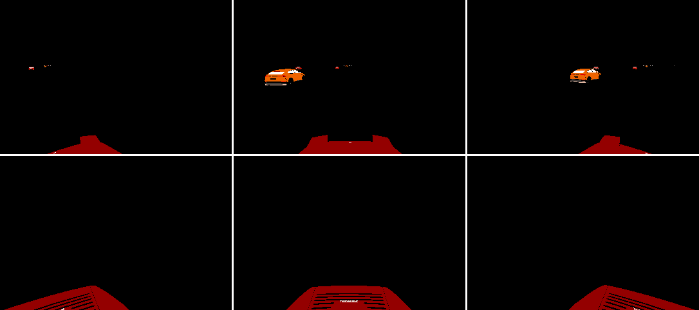

Vehicle RGB Sensors
===================

Within TSHub3D, vehicles are the pivotal object in traffic simulation. Each vehicle is able to be outfitted with multiple sensors to capture information about the traffic environment from various perspectives. This section will delve into how sensors are deployed on vehicles and showcase the effects they capture.

Overview of Vehicle Sensors
---------------------------------------------

Each vehicle is equipped with six RGB sensors, covering the front, front-left, front-right, rear, rear-left, and rear-right viewpoints respectively. The following image illustrates the layout of these sensors on a vehicle.

.. figure:: ../../../_static/tshub3d_sensors/vehicle/vehicle_sensor_example.png
   :alt: Example of Vehicle Sensor Layout
   :align: center
   :figwidth: 75%

   Example of Vehicle Sensor Layout. The diagram shows the placement of six sensors on a vehicle.

Sensor Effects of the First Autonomous Vehicle
------------------------------------------------------------------

The first autonomous vehicle undertakes a straight-line task. Its six sensors have captured a comprehensive view of the surrounding environment, including lane markings, traffic signals, and nearby vehicles.

.. figure:: ../../../_static/tshub3d_sensors/vehicle/vehicle_ego0_all.gif
   :alt: Panoramic Sensor Effects of the First Vehicle
   :align: center

   Panoramic Sensor Effects of the First Vehicle. The surrounding environment during straight-line driving is shown from six different angles.

For the same vehicle, we can also obtain sensor data that only includes surrounding vehicles, which is invaluable for the training of autonomous driving algorithms.

   Vehicle Recognition Sensor Effects of the First Vehicle. The image showcases only other vehicles, with road and background information omitted.

Sensor Effects of the Second Autonomous Vehicle
--------------------------------------------------------------

The second vehicle makes a left turn at an intersection, and its sensors record real-time information from the front and rear during the turning process.

.. figure:: ../../../_static/tshub3d_sensors/vehicle/vehicle_ego1_all.gif
   :alt: Panoramic Sensor Effects of the Second Vehicle
   :align: center

   Panoramic Sensor Effects of the Second Vehicle. Detailed environmental information captured by six sensors during the left turn is displayed.

The following image shows sensor data containing only vehicles, aiding in focused behavior analysis and pattern recognition.

   Vehicle Recognition Sensor Effects of the Second Vehicle. The image includes vehicle information only, suitable for traffic behavior analysis.

Sensor Effects of the Third Autonomous Vehicle
---------------------------------------------------------

The sensor effects of the third vehicle are similar to the second vehicle, also performing a left turn.

.. figure:: ../../../_static/tshub3d_sensors/vehicle/vehicle_ego2_all.gif
   :alt: Panoramic Sensor Effects of the Third Vehicle
   :align: center

   Panoramic Sensor Effects of the Third Vehicle. The image shows the left turning process captured from six angles.

Finally, we present sensor data that has eliminated the road and non-vehicle objects, facilitating object detection and tracking.

.. figure:: ../../../_static/tshub3d_sensors/vehicle/vehicle_ego2_vehicle.gif
   :alt: Vehicle Recognition Sensor Effects of the Third Vehicle
   :align: center

   Vehicle Recognition Sensor Effects of the Third Vehicle. The image displays only vehicles, providing a clear target view.

Through these sensors, TSHub3D is capable of providing a wealth of environmental data for autonomous driving vehicles, which is crucial for the perception, planning, and control of autonomous driving systems.