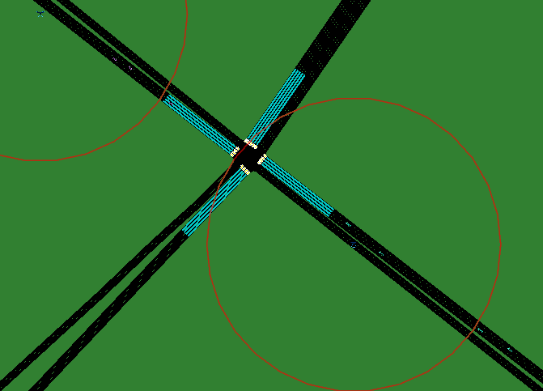

飞行器
=================

Aircraft（飞行器） 可以用于在 `SUMO` 中仿真不同的飞行器，例如无人机，载人飞行器等。
关于 Aircraft 的代码例子 `TransSimHub Aircraft Example <https://github.com/Traffic-Alpha/TransSimHub/tree/main/examples/aircraft>`_。
下面介绍 Aircraft 的状态（ `state`）， 动作类型（ `action type`）和使用例子:

状态定义
~~~~~~~~~~~~

- **飞行器 id** (str): 场景中每一个 aircraft 的唯一 ID，用于区分不同的 aircraft
- **飞行器类型 aircraft_type** (str): 定义每一个 aircraft 的类型，例如无人机，空艇等，可以在执行 action 的时候对不同类型的 aircraft 执行不同的动作
- **动作类型 action_type** (str): aircraft 的动作类型，目前支持 `Stationary`, `HorizontalMovement`, `CombinedMovement` 和 `CombinedMovement`
- **位置 position** (tuple[float, float, float]):飞行器现在所在的位置
- **速度 speed** (float): 飞行器飞行的速度
- **方向角 heading** (tuple[float, float, float]): 飞行器的飞行角度
- **通信能力 communication_range** (float): 飞行器的通信能力
- **地面覆盖范围 ground_cover_radius** (float): 根据 aircraft 的高度和通信能力，计算出以 aircraft 的投影点为中心，地面的覆盖半径

动作定义
~~~~~~~~~~~~

1. **Stationary**: 在固定位置保持不动。
2. **HorizontalMovement**: 在固定的高度，只能在水平方向移动。

  .. list-table::
    :header-rows: 1

    * - 参数
      - 描述
    * - Speed (float)
      - 改变飞行器的速度
    * - Heading (int)
      - 这里输入是 heading index，平面内被分为 8 个 heading 角度

  .. note::

    下面是飞行器在 `HorizontalMovement` 的动作下，
    不同 heading 角度及其对应的飞行方向：

    1. 0 度: 向右飞行: ->
    2. 45 度: 右上方飞行: ↗
    3. 90 度: 向上飞行: ↑
    4. 135 度: 左上方飞行: ↖
    5. 180 度: 向左飞行: <-
    6. 225 度: 左下方飞行: ↙
    7. 270 度: 向下飞行: ↓
    8. 315 度: 右下方飞行: ↘

3. **VerticalMovement**: 只能改变高度，水平方向无法移动。

  .. list-table::
    :header-rows: 1

    * - 参数
      - 描述
    * - Speed (float)
      - 改变飞行器的速度
    * - Heading (int)
      - 这里输入是 heading index，共有三种情况:
        1. 向上
        2. 向下
        3. 平稳

4. **CombinedMovement**: 可以同时改变高度和水平方向移动，但是动作空间是离散的。

  .. list-table::
    :header-rows: 1

    * - 参数
      - 描述
    * - Speed (float)
      - 改变飞行器的速度
    * - Heading (int)
      - 水平角与俯仰角的所有组合
    * -
      - 水平可移动角度 AZIMUTHS = [0, 45, 90, 135, 180, 225, 270, 315]
    * - 
      - 俯仰角 ELEVATIONS = [-90, -45, 0, 45, 90]

.. note::

  下面是水平角与俯仰角的所有组合，共有 40 种：

  .. list-table:: The Combination of the Azimuths and Elevations
    :header-rows: 1

    * - Azimuths \ Elevations
      - -90
      - -45
      - 0
      - 45
      - 90
    * - 0
      - (0, -90) - Index 1
      - (0, -45) - Index 2
      - (0, 0) - Index 3
      - (0, 45) - Index 4
      - (0, 90) - Index 5
    * - 45
      - (45, -90) - Index 6
      - (45, -45) - Index 7
      - (45, 0) - Index 8
      - (45, 45) - Index 9
      - (45, 90) - Index 10
    * - 90
      - (90, -90) - Index 11
      - (90, -45) - Index 12
      - (90, 0) - Index 13
      - (90, 45) - Index 14
      - (90, 90) - Index 15
    * - 135
      - (135, -90) - Index 16
      - (135, -45) - Index 17
      - (135, 0) - Index 18
      - (135, 45) - Index 19
      - (135, 90) - Index 20
    * - 180
      - (180, -90) - Index 21
      - (180, -45) - Index 22
      - (180, 0) - Index 23
      - (180, 45) - Index 24
      - (180, 90) - Index 25
    * - 225
      - (225, -90) - Index 26
      - (225, -45) - Index 27
      - (225, 0) - Index 28
      - (225, 45) - Index 29
      - (225, 90) - Index 30
    * - 270
      - (270, -90) - Index 31
      - (270, -45) - Index 32
      - (270, 0) - Index 33
      - (270, 45) - Index 34
      - (270, 90) - Index 35
    * - 315
      - (315, -90) - Index 36
      - (315, -45) - Index 37
      - (315, 0) - Index 38
      - (315, 45) - Index 39
      - (315, 90) - Index 40

Aircraft 控制例子
~~~~~~~~~~~~~~~~~~~~~~

下面具体看一个 Aircraft 的控制的例子（完整代码见 `TransSimHub Aircraft Horizontal Control <https://github.com/Traffic-Alpha/TransSimHub/blob/main/examples/aircraft/aircraft_actions/aircraft_horizontal.py>`_）。
下面是初始化 aircraft 的参数。我们指定每一个 aircraft 的动作类型，初始位置，速度等。

.. code-block:: python

    aircraft_inits = {
        'a1': {
            "aircraft_type": "drone",
            "action_type": "horizontal_movement", 
            "position":(1500,1110,100), "speed":10, "heading":(1,1,0), "communication_range":200, 
            "if_sumo_visualization":True, "img_file":None},
        'a2': {
            "aircraft_type": "drone",
            "action_type": "horizontal_movement", 
            "position":(1900,800,100), "speed":10, "heading":(1,1,0), "communication_range":200, 
            "if_sumo_visualization":True, "img_file":None
        }
    }

接着根据参数我们在场景中初始化 aircraft，这个 `conn` 传入 `traci` 的连接：

.. code-block:: python

    from tshub.aircraft.aircraft_builder import AircraftBuilder

    scene_aircraft = AircraftBuilder(sumo=conn, aircraft_inits=aircraft_inits)

接着我们通过 `get_objects_infos` 来得到 `aircraft` 的属性：

.. code-block:: python

    aircraft_state = scene_aircraft.get_objects_infos()

返回的属性如下所示，可以看到包含每一个 aircraft 的位置，覆盖范围等：

.. code-block:: python

    2023-09-04T16:00:08.929810+0800 | INFO   | SIM: {
        "a1": {
            "id": "a1",
            "aircraft_type": "drone",
            "action_type": "horizontal_movement",
            "position": [
                1496.4644660940673,
                1120.606601717798,
                100
            ],
            "speed": 5,
            "heading": [
                -0.7071067811865475,
                0.7071067811865476,
                0
            ],
            "communication_range": 200,
            "ground_cover_radius": 173.20508075688772,
            "if_sumo_visualization": true,
            "img_file": "/home/wmn/TransSimHub/tshub/aircraft/./aircraft.png"
        },
        "a2": {
            "id": "a2",
            "aircraft_type": "drone",
            "action_type": "horizontal_movement",
            "position": [
                1903.5355339059327,
                796.4644660940672,
                100
            ],
            "speed": 5,
            "heading": [
                -0.7071067811865477,
                -0.7071067811865475,
                0
            ],
            "communication_range": 200,
            "ground_cover_radius": 173.20508075688772,
            "if_sumo_visualization": true,
            "img_file": "/home/wmn/TransSimHub/tshub/aircraft/./aircraft.png"
        }
    }

这里我们设置的动作类型是 `horizontal_movement`，也就是只能水平进行移动。
于是我们的动作包含两个部分，分别是「速度」和「heading index」，下面是控制的例子：

.. code-block:: python

    actions = {
        "a1": (5, np.random.randint(8)),
        "a2": (5, np.random.randint(8)),
    }
    scene_aircraft.control_objects(actions)

如果我们将 `if_sumo_visualization` 设置为 `True`，可以看到仿真画面。如下图所示，圆圈表示 aircraft 在地面的通信覆盖范围，且可以看到飞行器都是在水平移动：

