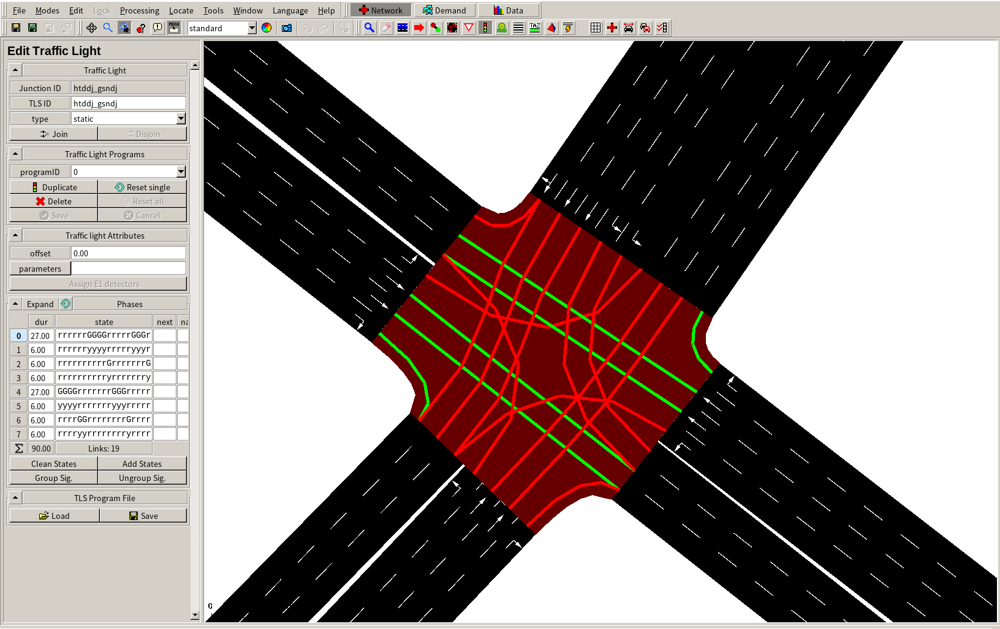
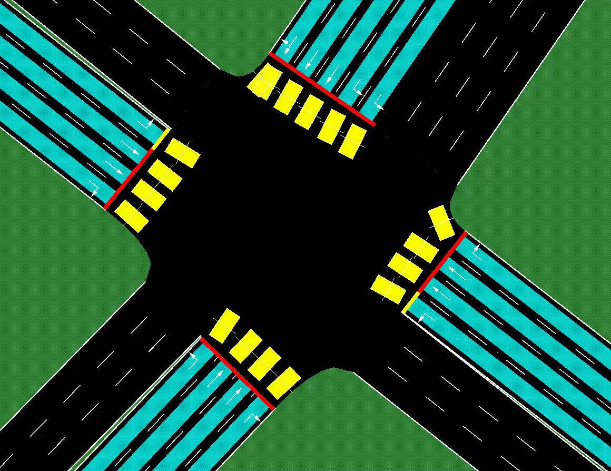

信号灯
===========================

Traffic Signal Lights（信号灯）可以用于在 `SUMO` 中仿真交通路口的信号灯，用于交通控制。
关于「信号灯」的代码例子 `TransSimHub Traffic Light Example <https://github.com/Traffic-Alpha/TransSimHub/tree/main/examples/traffic_light>`_。
下面介绍 Traffic Light 的状态（ `state`）， 动作类型（ `action type`）和使用例子:

信号灯状态定义
------------------

- **信号灯 ID 列表 tls_ids** (List[str])：场景中信号灯 ID 列表，每个信号灯拥有唯一 ID，用于区分不同的信号灯
- **动作类型 action_type** (str)：信号灯支持的动作类型，目前支持 `choose_next_phase`  和 `next_or_not`
- **动作间隔 delta_time** (int)：信号灯执行相邻动作的时间间隔，即每 delta_time 信号灯做一次动作
- **所有信号灯 traffic_lights** (dict())：用于存储场景中的所有交通信号灯
- **当前相位 ID this_phase_index** (int): 观测时信号灯的相位 ID
- **当前相位 this_phase** (List[bool]): 观测时信号灯的相位，转换为对应控制的 `movement`
- **上一次相位 last_phase** (List[bool]): 信号灯在上一次观测时的相位
- **下一次相位 next_phase** (List[bool]): 信号灯的相位列表中，下一次切换需要执行的相位（ `next_or_not` 动作中需要预定义相位顺序）
- **通行方向 movement_directions** (Dict[str, str])：交通路口中每一个 movement 的方向
- **车道数 movement_lane_numbers** (List[int])：交通路口中每个通行方向包含的车道数
- **运动方向ID movement_ids** (List[str])：存储每个 movement ID，格式是来自那条路去那条路 (fromEdge, toEdge)
- **相位 phase2movements** (Dict[int, List[str]])：记录每个相位控制的通行方向组合
- **可否执行动作 can_perform_action** (bool)：当前是否可以执行信号灯相位的切换，相位在切换时需要满足最短执行时间

对于信号灯所控制路口的交通状态，我们使用探测器来获得。
探测器用于获得路口的情况，包括车流、平均占有率等。

- **上次观测平均速度 last_step_mean_speed** (List[float])：上一次观测中，经过探测器的车的平均速度，-1 表示没有车
- **排队车数量 jam_length_vehicle** (List[float])：当前观测中，排队车的数量
- **排队车长度 jam_length_meters** (List[float])：排队车的长度
- **平均占有率 last_step_occupancy** (List[float])：车道的平均占有率

动作定义
-----------

- **选择下一个相位 ChooseNextPhase**: 从信号灯的相位列表中选择一个作为下一个相位。
  
  .. list-table::
    :header-rows: 1

    * - 参数
      - 描述
    * - Action (int)
      - 相位 ID (Phase Index)
   
- **执行下一个相位 NextorNot**: 保持当前相位或是切换到下一个相位。
  与上面的动作设计相比，这个动作设计可以保持原有信号灯相位顺序不做改变。

  .. list-table::
    :header-rows: 1
    
    * - 参数
      - 描述
    * - Action (int)
      - 保持当前相位或切换到下一个相位
    * -
      - `0` 切换到下一个相位
    * -
      - `1` 保持当前相位
  

信号灯控制例子
-----------------------

下面具体看一个信号灯的控制的例子（完整代码见 `TransSimHub Traffic Light Control <https://github.com/Traffic-Alpha/TransSimHub/tree/main/examples/traffic_light/traffic_light_action>`_）。
下面是我们要控制的信号灯，共包含 4 个绿灯相位：

接着我们在场景中初始化信号灯。
我们需要传入要控制的信号灯的 ID，控制的动作类型，和 `traci` 的连接：

.. code-block:: python

    from tshub.traffic_light.traffic_light_builder import TrafficLightBuilder

    scene_traffic_lights = TrafficLightBuilder(
      sumo=conn, 
      tls_ids=['htddj_gsndj'], 
      action_type='choose_next_phase'
    )

接着我们通过 `tls_infos` 来得到 `traffic light` 的属性：

.. code-block:: python

  tls_infos = scene_traffic_lights.get_objects_infos()

返回的属性如下所示，可以看到包含每一个信号灯的「静态信息」和「动态信息」。
「静态信息」包含信号灯本身的结构信息，例如 `movement_directions`、 `movement_lane_numbers` 和 `phase2movements` 等。
「动态信息」包含 `last_step_mean_speed`、 `jam_length_vehicle` 和 `last_step_occupancy` 等。

.. code-block:: python

  {
    "htddj_gsndj": {
        "id": "htddj_gsndj",
        "action_type": "choose_next_phase",
        "delta_time": 5,
        "last_step_mean_speed": [
            0.0,
            0.0,
            0.0,
            0.0,
            0.0,
            0.0,
            0.0,
            0.0,
            0.0,
            0.0,
            0.0,
            0.0
        ],
        "jam_length_vehicle": [
            0.0,
            0.0,
            0.0,
            0.0,
            0.0,
            0.0,
            0.0,
            0.0,
            0.0,
            0.0,
            0.0,
            0.0
        ],
        "jam_length_meters": [
            0.0,
            0.0,
            0.0,
            0.0,
            0.0,
            0.0,
            0.0,
            0.0,
            0.0,
            0.0,
            0.0,
            0.0
        ],
        "last_step_occupancy": [
            0.0,
            0.0,
            0.0,
            0.0,
            0.0,
            0.0,
            0.0,
            0.0,
            0.0,
            0.0,
            0.0,
            0.0
        ],
        "this_phase": [
            false,
            false,
            false,
            false,
            false,
            false,
            false,
            true,
            true,
            false,
            true,
            true
        ],
        "last_phase": [
            false,
            false,
            false,
            false,
            false,
            false,
            false,
            false,
            false,
            false,
            false,
            false
        ],
        "next_phase": [
            false,
            false,
            false,
            false,
            false,
            false,
            false,
            false,
            false,
            false,
            false,
            false
        ],
        "movement_directions": {
            "29257863#2_r": "r",
            "29257863#2_s": "s",
            "29257863#2_l": "l",
            "gsndj_n7_r": "r",
            "gsndj_n7_s": "s",
            "gsndj_n7_l": "l",
            "161701303#7.248_r": "r",
            "161701303#7.248_s": "s",
            "161701303#7.248_l": "l",
            "gsndj_s4_r": "r",
            "gsndj_s4_s": "s",
            "gsndj_s4_l": "l"
        },
        "movement_lane_numbers": {
            "29257863#2_r": 1,
            "29257863#2_s": 3,
            "29257863#2_l": 2,
            "gsndj_n7_r": 1,
            "gsndj_n7_s": 2,
            "gsndj_n7_l": 1,
            "161701303#7.248_r": 1,
            "161701303#7.248_s": 2,
            "161701303#7.248_l": 1,
            "gsndj_s4_r": 1,
            "gsndj_s4_s": 2,
            "gsndj_s4_l": 1
        },
        "movement_ids": [
            "161701303#7.248_l",
            "161701303#7.248_r",
            "161701303#7.248_s",
            "29257863#2_l",
            "29257863#2_r",
            "29257863#2_s",
            "gsndj_n7_l",
            "gsndj_n7_r",
            "gsndj_n7_s",
            "gsndj_s4_l",
            "gsndj_s4_r",
            "gsndj_s4_s"
        ],
        "phase2movements": {
            "0": [
                "gsndj_n7--r",
                "gsndj_s4--r",
                "gsndj_n7--s",
                "gsndj_s4--s"
            ],
            "1": [
                "gsndj_n7--l",
                "gsndj_s4--l"
            ],
            "2": [
                "161701303#7.248--s",
                "29257863#2--r",
                "161701303#7.248--r",
                "29257863#2--s"
            ],
            "3": [
                "161701303#7.248--l",
                "29257863#2--l"
            ]
        },
        "can_perform_action": true
    }
  }

这里我们设置的动作类型是 `choose_next_phase`，也就是选择下一个相位。
于是我们的动作就是制定下一个相位的 ID 什么。
下面是控制的例子，我们传入 ‵phase index`：

.. code-block:: python

  scene_traffic_lights.control_objects({'htddj_gsndj':action_index})

如果我们将 `if_sumo_visualization` 设置为 `True`，可以看到仿真画面。

