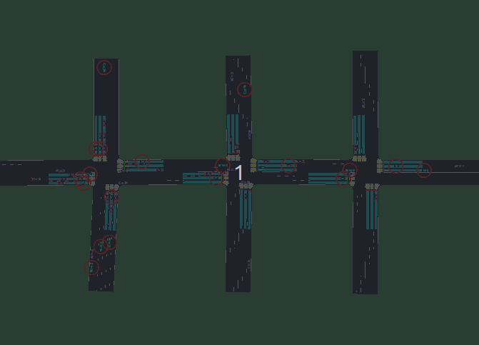

机动车
============

Vehicle（机动车）模块用于在 `SUMO` 中仿真车辆，例如：自动驾驶汽车、环境车等。
关于场景中创建和控制 Vehicle 的例子详细见 `TransSimHub Vehicle Example <https://github.com/Traffic-Alpha/TransSimHub/tree/main/examples/vehicles>`_。
下面介绍 Vehicle 的状态（ `state`）， 动作类型（ `action type`）和使用例子:

状态定义
~~~~~~~~~~~~~

- **机动车 id** (str): 场景中每一个 vehicle 的唯一 ID，用于区分不同的 vehicle
- **动作类型 action_type** (str): vehicle 的动作控制类型, 目前支持 `lane` 和 `lane_continuous_speed`
- **位置 position** (Tuple[float]): vehicle 所在的位置 (x,y)
- **速度 speed** (float): vehicle 当前车速
- **路 road_id** (str): vehicle 行驶道路的 ID
- **车道 lane_id** (str): vehicle 所在车道的 ID
- **边 edges** (list[str]): vehicle 已经经过的边
- **下一个相位 next_tls** (List[str]): vehicle 将通过的交通信号灯的 ID（如果前方没有信号灯则是空）
- **等待时间 waiting_time** (float): vehicle 的等待时间（由于信号灯或堵车等原因），一旦车辆开始行驶，等待时间清零
- **累积等待时间 accumulated_waiting_time** (float): vehicle 的累积等待时间
- **车辆的行驶距离 distance** (float): vehicle 的累积行驶距离
- **前车信息 leader** (Tuple[str, float]): 当前车辆前车的信息，包含前车的 id 和距离

=
动作类型
~~~~~~~~~~~~~~

1. **lane**：四个离散的动作，同时改变车辆的速度和变道：

  .. list-table::
    :header-rows: 1 

    * - 参数
      - 简短描述
      - 具体描述
    * - 0
      - keep_lane（str）
      - vehicle 保持当前车道，改变 vehicle 的速度, 速度增加 3 m/s，但小于最高限速 15 m/s（约等于 54km/h）
    * - 1
      - slow_down (str)
      - vehicle 保持当前车道，改变 vehicle 的速度, vehicle 速度减少 3 m/s，但要高于最低限速 2 m/s（约等于 7.2km/h）
    * - 2
      - change_lane_left (str)
      - vehicle 向左侧变道，改变 vehicle 的速度, vehicle 速度减少 2 m/s，但高于最低限速 2 m/s
    * - 3
      - change_lane_left (str)
      - vehicle 向右侧变道，改变 vehicle 的速度, vehicle 速度减少 2 m/s，但高于最低限速 2 m/s

2. **lane_continuous_speed**: 改变车道，并且可以连续控制速度。当 `speed` 设置为 -1 的时候，车辆保持当前速度不变。这个动作退化为只进行变道的调整。

  .. list-table::
    :header-rows: 1 

    * - 参数（速度，变道）
      - 变道 index
      - 描述
    * - (speed, 0)
      - 0 -> keep_lane
      - 保持当前车道 
    * - (speed, 1)
      - 1 -> change_lane_left
      - 向左侧变道 
    * - (speed, 2)
      - 2 -> change_lane_right
      - 向右侧变道

  .. note::
    1. vehicle 分为可自动驾驶车（ego vehicle）和背景车（background vehicle），背景车辆只能获得观测信息不可控制，自动驾驶车可控。
    2. 可以通过 `env wrapper`，实现获取或控制部分车辆。

车辆控制例子
~~~~~~~~~~~~~~~~~~

下面具体看一个车辆的控制的例子（完整代码见 `TransSimHub Vehicle Lane Control <https://github.com/Traffic-Alpha/TransSimHub/blob/main/examples/vehicles/vehicle_action/vehicle_ego.py>`_）。
我们在 `route` 中定义了两种不同类型的车辆，如下所示：

 .. code-block:: python

    <vType id="background" length="7.00" maxSpeed="15.00" color="155,89,182" tau="1.0"/>
    <vType id="ego" length="7.00" maxSpeed="17.00" color="26,188,156" tau="1.0"/>

    <vehicle id="-E9__0__background.0" type="background" depart="0.84" departLane="random">
        <route edges="-E9 E4"/>
    </vehicle>
    <vehicle id="E0__0__background.0" type="background" depart="3.58" departLane="random">
        <route edges="E0 E4"/>
    </vehicle>
    <vehicle id="-E4__0__ego.0" type="ego" depart="4.16" departLane="random">
        <route edges="-E4 -E0"/>
    </vehicle>

接着我们在环境中初始化车辆，并指定车辆的控制动作。

 .. code-block:: python

    from tshub.vehicle.vehicle_builder import VehicleBuilder
    scene_vehicles = VehicleBuilder(
      sumo=conn, action_type='lane'
    )  

接着我们通过 `get_objects_infos` 来得到 `vehicle` 的属性：

 .. code-block:: python

    data = scene_vehicles.get_objects_infos()

返回的属性如下所示，可以看到包含每一个 vehicle 的位置，速度等：

 .. code-block:: python

  {
    "gsndj_s4__0.0": {
        "id": "gsndj_s4__0.0",
        "action_type": "lane",
        "position": [
            1217.0713040366447,
            1370.0102791296881
        ],
        "speed": 0,
        "road_id": "gsndj_s4",
        "lane_id": "gsndj_s4_2",
        "lane_index": 2,
        "edges": [],
        "waiting_time": 0,
        "accumulated_waiting_time": 18.0,
        "distance": 1122.5802917752023,
        "leader": [
            "29257863#2__19.13",
            81.95232096332472
        ],
        "next_tls": []
    }
  }

这里我们设置的动作类型是 `lane`，动作空间是离散的四个值。
因为这里我们希望只对 `ego vehicle` 进行控制，故我们写一个函数筛选出所有 `ego vehicle`：

  .. code-block:: python

    def filter_ego_id(vehicle_data):
      ego_ids = []
      for _veh_id, _veh_info in vehicle_data.items():
          if _veh_info['vehicle_type'] == 'ego':
              ego_ids.append(_veh_id)
      return ego_ids

下面我们通过 `control_objects` 来控制车辆。
我们利用 `filter_ego_id` 筛选出所有 `ego vehicle` 的 `id`，
接着对其随机生成动作，使用 `np.random.randint(4)`：
  
  .. code-block:: python

    while conn.simulation.getMinExpectedNumber() > 0:
        # 获得车辆的信息
        data = scene_vehicles.get_objects_infos()

        # 控制部分车辆, 分别是 lane_change, speed
        ego_vehicles = filter_ego_id(data)
        actions = {_veh_id:(np.random.randint(4), None) for _veh_id in ego_vehicles}
        scene_vehicles.control_objects(actions)

        conn.simulationStep()

  
如果我们将 `if_sumo_visualization` 设置为 `True`，可以看到仿真画面。
如下图所示，带圆圈的 `vehicle` 表示正在被控制（也就是 `ego vehicle`）。

