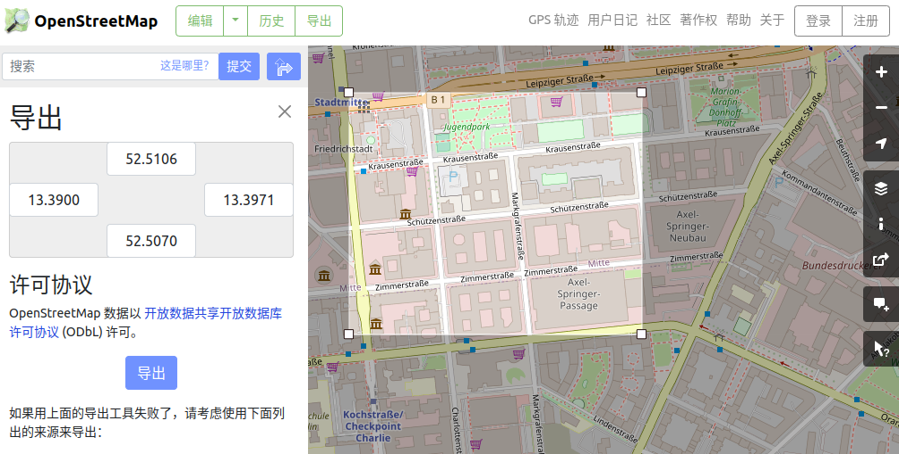
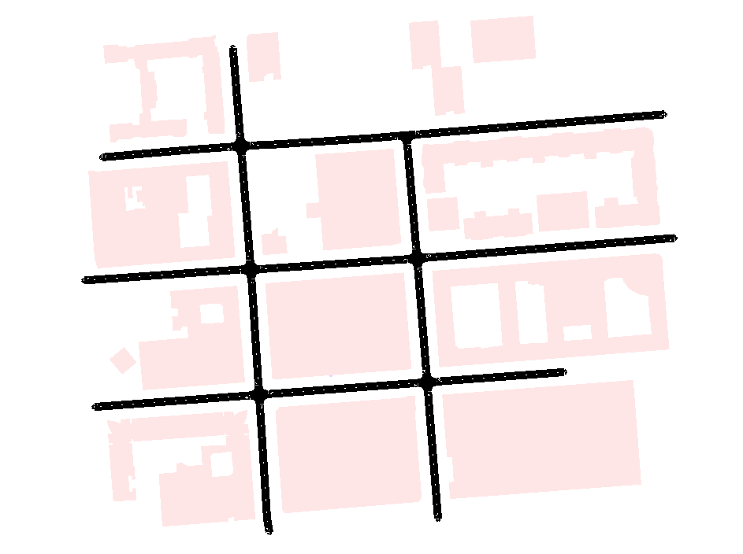
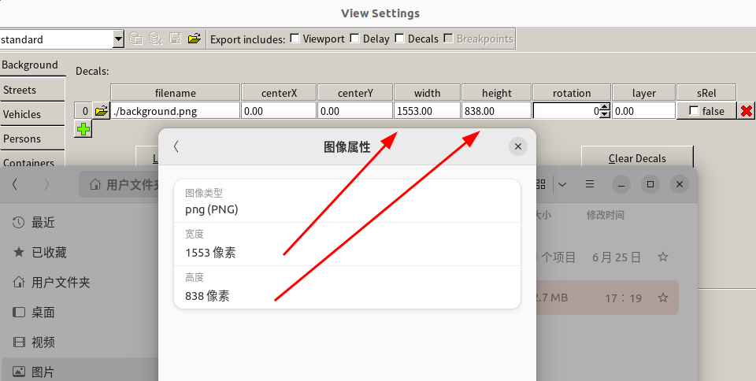
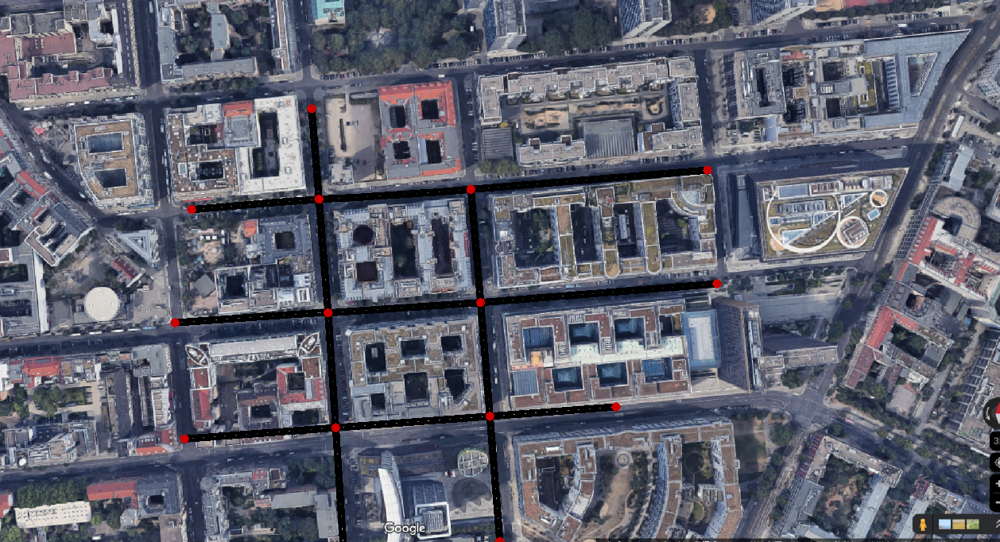
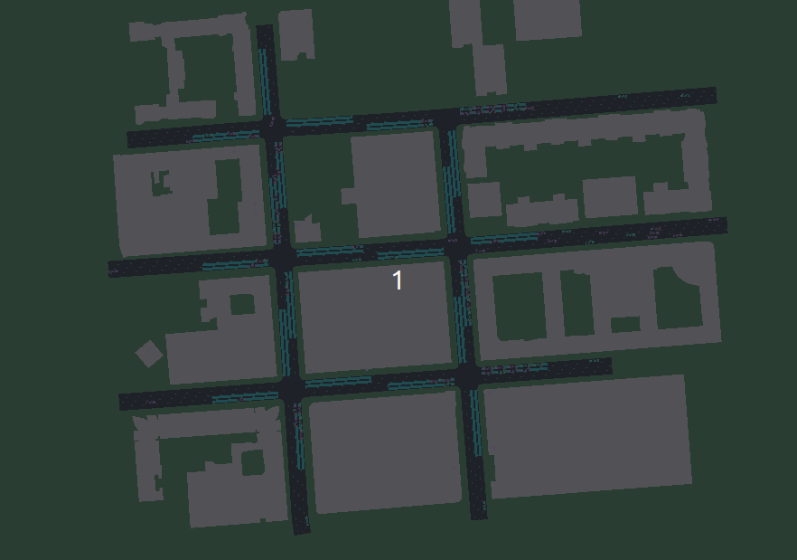

创建仿真场景：一个逐步示例
===========================

在这篇教程中，我们将逐步演示如何构建真实的仿真环境。

OSM 地图导出
~~~~~~~~~~~~~~~~~~~~~~~~~~~~~~~~~

第一步，我们需要获取真实的地图信息。我们可以通过 `OpenStreetMap <https://www.openstreetmap.org/>`_ 来获取感兴趣的区域。
在选择了感兴趣的区域并进行框选后，我们可以导出地图，如下图所示：

此时我们会得到一个 ``*.osm`` 文件，我们将其重命名为 ``berlin.osm``，并保存在 `TSHub-berlin <https://github.com/Traffic-Alpha/TransSimHub/blob/main/examples/sumo_env/osm_berlin/berlin.osm>`_。

OSM 转换为 Net 和 Polygon
~~~~~~~~~~~~~~~~~~~~~~~~~~~~~~~~~

在获得了 ``berlin.osm`` 文件之后，我们可以使用 ``scenario_build`` 函数根据该文件生成 ``*.net.xml`` 和 ``*.poly.xml`` 文件，用于后续的仿真。
以下是转换的核心代码，完整的例子可以在 `osm_build.py <https://github.com/Traffic-Alpha/TransSimHub/blob/main/examples/sumo_tools/osm_build.py>`_ 中找到：

.. code-block:: python

   from tshub.sumo_tools.osm_build import scenario_build

   osm_file = "berlin.osm"
   output_directory = "./"
   scenario_build(
       osm_file=osm_file,
       output_directory=output_directory
   )

运行上述代码后，我们将分别得到 ``berlin.net.xml`` 和 ``berlin.poly.xml`` 文件（参见 `osm_berlin <https://github.com/Traffic-Alpha/TransSimHub/tree/main/examples/sumo_env/osm_berlin/env/>`_）。这样就完成了 OSM 数据的转换。
我们可以使用 ``sumo-gui`` 进行可视化，如下图所示：

.. note::

    实际中，我们需要根据实际情况修改车道数、车道速度等相关属性。
    直接从 `OpenStreetMap`` 上获取的信息可能不完全准确。
    同时，还需要去除掉头，否则车辆可能无法驶出路网。

添加背景图片（选择）
~~~~~~~~~~~~~~~~~~~~~~~~~~~~~~~~~

在完成地图转换后，为了使可视化结果更加美观，我们可以添加背景图片。
我们可以根据导出时的经纬度信息（或使用 ``sumo-gui`` 查看经纬度），在地图上找到对应的区域，并将其保存为图片。

.. note::

    截图的区域需要包含比例尺，以便我们后面调节图片的尺寸。

保存图片后，我们在 ``netedit`` 中打开路网并导入图片。首先，查看下载图片的原始大小，并在插入后修改为原始图像大小。

设置完成后，在比例尺的位置绘制一个车道，然后查看此车道的长度和比例尺的长度。在本例中，比例尺长度为 50 米，绘制的车道长度为 87 米，因此我们需要修改图片的长和宽。
对于本例，图像的长度为 1553 像素，宽度为 838 像素。

.. math::

   \frac{1553}{x} = \frac{838}{y} = \frac{87}{50}

解上述方程，最后得到新图像的长度为 892.5 像素，宽度为 481.6 像素。
将其设为新图像的长度和宽度。最后，调整 ``centerX`` 和 ``centerY``，我们就可以在原始路网上添加背景图片了。

添加背景图片后，我们创建一个新的 ``viewsettings`` 来保存可视化的一些设置：

.. code-block:: xml

   <viewsettings>
       <scheme name="standard"/>
       <viewport zoom="100" x="280" y="245" angle="0.00"/>
       <delay value="50"/>
       <decal file="background.png" centerX="280" centerY="245" width="892.52873" height="481.609195" rotation="-1.00"/>
   </viewsettings>

最后，我们只需要在 ``sumocfg`` 文件中加入 ``viewsettings``：

.. code-block:: xml

   <configuration>
       <input>
           <net-file value="berlin.net.xml"/>
           <additional-files value="berlin.poly.xml"/>
           <gui-settings-file value="viewsettings.xml"/>
       </input>
   </configuration>

有关插入背景图像的更多信息，请参考 `Import a background image and set scale in NETEDIT : SUMO <https://www.youtube.com/watch?v=rTT0vKzikpg>`_。

.. note::

    这里背景图片可能会和路网有一些不能完全对齐。
    但是这里背景图只是用作可视化，完全不影响最终的仿真结果。

创建探测器和信号灯输出文件
~~~~~~~~~~~~~~~~~~~~~~~~~~~~~~~~~

在完成了路网的创建后，我们可以为该路网生成「探测器」和「信号灯输出」。有关这两部分内容的详细信息，请参考以下文档：

- `TSHub-信号灯输出 <https://transsimhub.readthedocs.io/en/latest/locales/zh_CN/sumo_tools/tls_addition.html>`_
- `TSHub-探测器生成 <https://transsimhub.readthedocs.io/en/latest/locales/zh_CN/sumo_tools/generate_detectors.html>`_

完整的脚本文件可以在 `TLS Additional Files <https://github.com/Traffic-Alpha/TransSimHub/tree/main/examples/sumo_env/osm_berlin/script/>`_ 中找到。

创建车流
~~~~~~~~~~~~~~~~~~~~~~~~~~~~~~~~~

到目前为止，我们已经完成了静态路网的编辑。最后，我们需要在路网上生成车流。有关车辆生成的详细信息，请参考 `TSHub-生成车流 <https://transsimhub.readthedocs.io/en/latest/locales/zh_CN/sumo_tools/generate_routes.html>`_。
在这里，我们只需要指定时间段、每个时间段每个边缘（edge）进入的车辆数量以及转向概率等参数。以下是部分生成车流的示例参数：

.. code-block:: python

   generate_route(
       sumo_net=sumo_net,
       interval=[5,5,5], 
       edge_flow_per_minute={
           '65040946#0': [8, 8, 8],
           '24242838#0': [8, 8, 8],
           '1152723807': [7, 7, 7],
           '-32938173#2': [7, 7, 7],
           '-1147648945#1': [10, 10, 13],
           '-1152723815': [10, 10, 7],
           '-1105574288#1': [10, 10, 9],
           '-23755718#2': [10, 10, 7]
       },  # 每分钟每个边缘的车辆数量
       edge_turndef={
           '24242838#0__24242838#5': [0.7, 0.7, 0.8],
           '24242838#5__1105574288#0': [0.9, 0.9, 0.9],
       },
       veh_type={
           'ego': {'color':'26, 188, 156', 'probability':0.3},
           'background': {'color':'155, 89, 182', 'speed':15, 'probability':0.7},
       },
       output_trip=current_file_path('./testflow.trip.xml'),
       output_turndef=current_file_path('./testflow.turndefs.xml'),
       output_route=current_file_path('../env/berlin.rou.xml'),
       interpolate_flow=False,
       interpolate_turndef=False,
   )

完整的脚本文件可以在 `Berlin-generate_routes <https://github.com/Traffic-Alpha/TransSimHub/tree/main/examples/sumo_env/osm_berlin/script/generate_routes.py>`_ 中找到。
至此我们完成了场景的创建，仿真界面如下所示：

