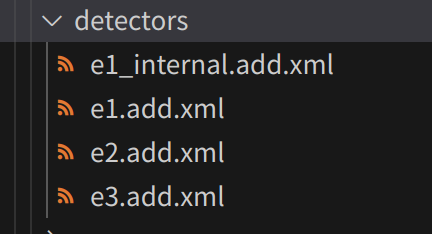

探测器生成
===========================

通常我们会在环境中设置探测器（ `detector`）来得到路口的状态（例如路口的排队长度，车辆 ID 等）。
在 `TransSimHub` 中，我们提供了 `generate_detector` 工具来自动生成路网中所需要的探测器。
完整例子请见 `TransSimHub Generate Detectors Example <https://github.com/Traffic-Alpha/TransSimHub/blob/main/examples/sumo_tools/generate_tls_detectors.py>`_

探测器生成工具 - generate_detector
~~~~~~~~~~~~~~~~~~~~~~~~~~~~~~~~~~~~~~~~~~~

下面是使用 `generate_detector` 的一个简单的例子。

.. code-block:: python

  from tshub.sumo_tools.generate_detectors import generate_detector

  # start simulation
  netfile_path = 'xxx.net.xml'
  traci.start(["sumo", "-n", netfile_path])

  # generate detectors
  g_detectors = generate_detector(traci)
  g_detectors.generate_multiple_detectors(
      tls_list=['J1','J2','J3'], 
      result_folder='xxx',
      detectors_dict={
        'e1':dict(), 
        'e1_internal':dict(), 
        'e2':{'detector_length':30}, 
        'e3':dict()
      }
  )

我们调用 `generate_multiple_detectors` 来生成不同类型的探测器。
下面是参数的详细说明：

- **路口 tls_list** (List[str])：需要为哪些路口生成探测器，这里给出路口的 ID；
- **文件路径  result_folder** (str)：生成的探测器保存到的文件夹；
- **探测器类型 detectors_dict** (List, optional): 生成的探测器的类型和额外的参数，目前支持 ['e1', 'e1_internal', 'e2', 'e3'] 

如果我们同时生成四种类型的探测器，就会在指定文件夹下生成四个 `.add.xml` 文件，如下所示：

探测器种类介绍
~~~~~~~~~~~~~~~~~~~~~~~~~

目前支持四种探测器类型，分别是 `e1` 、 `e1_internal` 、 `e2` 、 `e3`。
下面对这四种探测器进行介绍。

- **e1** : 生成 E1 探测器，在每一个 lane 的指定位置生成一个探测器。通常用于获得上一个时间段通过车辆的数量，速度等。`Induction Loop Value Retrieval <https://sumo.dlr.de/docs/TraCI/Induction_Loop_Value_Retrieval.html>`_。

  .. list-table::
    :header-rows: 1

    * - 参数
      - 描述
    * - results_file (str, optional)
      - 探测器结果输出的文件，默认为 e1.output.xml。
    * - distance_to_TLS (float, optional)
      - 探测器距离信号灯的位置, 默认 0.1 表示距离信号灯 0.1 m。
    * - freq (int, optional)
      - 指定探测器的探测周期，默认是 60s 在 results_file 中输出 1 次。这个值不会影响 `traci` 提取信息的频率。

- **e1_internal**：上面 E1 探测器的变种。在交叉路口内部每一个 `connection` 设置探测器, 获得转向数据。由于有多功能车道的存在（一个车道左转和直行的功能都具备），我们无法通过上面的 E1 探测器获得有多少车左转，有多少车直行。于是 E1 Interval 就是用于获得转向车辆的信息。

  .. list-table::
    :header-rows: 1

    * - 参数
      - 描述
    * - results_file (str, optional)
      - 探测器结果输出的文件，默认为 e1_internal.output.xml。
    * - freq (int, optional)
      - 指定探测器的探测周期，默认是 60s 在 results_file 中输出 1 次。

- **e2**：生成 E2 探测器，在每一个 lane 上都有指定的覆盖距离，获得这段范围内车辆的信息。这里可以通过调整 `detector_length` 改变探测器的长度。注意如果探测器的长度大于路的长度，则默认铺满整条路。`Lane Area Detector Value Retrieval <https://sumo.dlr.de/docs/TraCI/Lane_Area_Detector_Value_Retrieval.html>`_。

  .. list-table::
    :header-rows: 1

    * - 参数
      - 描述
    * - results_file (str, optional)
      - 探测器结果输出的文件，默认为 e2.output.xml。
    * - detector_length (float, optional)
      - 设置 E2 探测器的覆盖长度。
    * - distance_to_TLS (float, optional)
      -  E2 探测器探测的位置 (开始位置) 默认 -0.1m 是在道路的出口处。
    * - freq (int, optional)
      - 指定探测器的探测周期，默认是 60s 在 results_file 中输出 1 次。

这里 `E2` 探测器会用于信号灯控制的部分，用于获得信号灯周围的车道信息。
如下图所示，有蓝色覆盖的表示 `E2` 探测器覆盖的范围，我们可以获得这些覆盖范围内的信息：

- **e3**：E3 探测器会指定入口和出口，探测在入口到出口这一段距离内道路的信息。这里默认会在每一个 `connection` 生成探测器，设置在 `input lane` 出口的 1m，和 `output lane` 入口的 1m。`Multi-Entry-Exit Detectors (E3) <https://sumo.dlr.de/docs/Simulation/Output/Multi-Entry-Exit_Detectors_%28E3%29.html>`_。

  .. list-table::
    :header-rows: 1

    * - 参数
      - 描述
    * - results_file (str, optional)
      - 探测器结果输出的文件，默认为 e3.output.xml。
    * - freq (int, optional)
      - 指定探测器的探测周期，默认是 60s 在 results_file 中输出 1 次。