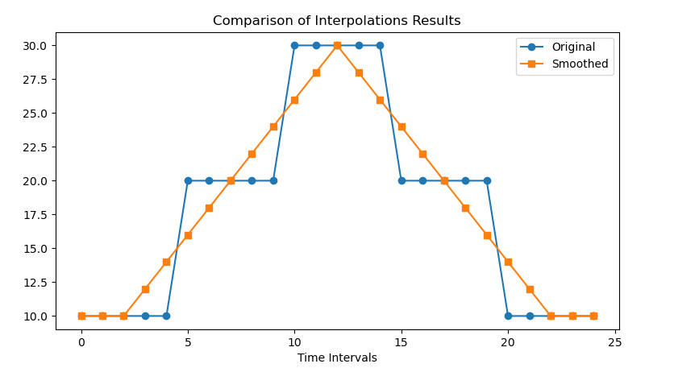

生成车流
==========

路网是用于仿真的车流文件（`.rou` 文件），其中定义了车辆的类型、出发时间和路径等信息。
手动编写这些信息可能比较困难，因此在 `TransSimHub` 中，我们提供了 `generate_route` 工具来辅助生成 `.rou.xml` 文件。
你可以在 `TransSimHub Generate Route Example <https://github.com/Traffic-Alpha/TransSimHub/blob/main/examples/sumo_tools/generate_routes.py>`_ 中找到完整的流量生成代码示例。

流量生成工具 - generate_route
~~~~~~~~~~~~~~~~~~~~~~~~~~~~~~~~~

我们使用 `sumo_tools` 中的 `generate_route` 工具可以生成自定义的 `.rou.xml` 文件。

.. code-block:: python
    
    from tshub.sumo_tools.generate_routes import generate_route

    generate_route(
        sumo_net, 
        interval, 
        edge_flow_per_minute, 
        edge_turndef, 
        veh_type, 
        output_trip, 
        output_turndef, 
        output_route, 
        interpolate_flow, 
        interpolate_turndef, 
        random_flow, 
        seed
    )

下面是参数的详细说明：

- `sumo_net` (str): sumo net 路网的文件路径。
- `interval` (List[float]): 时间间隔列表，每段时间的持续时间（分钟）。例如，`[20, 30]` 表示第一段时间持续 20 分钟，第二段时间持续 30 分钟。
- `edge_flow_per_minute` (Dict[str, List[float]]): 每个边（edge）在每个时间段内的车辆流量（车辆数/分钟）。下面的例子表示 `edge_1` 在第一个时间段内的流量为 10 辆/分钟，第二个时间段内的流量为 20 辆/分钟。

.. code-block:: python

    {
        'edge_1': [10, 20],
        'edge_2': [20, 30],
    }

- `edge_turndef` (Dict[str, List[float]]): 每个连接（connection）在每个时间段内的转弯概率。例如下面的例子，从 `fromEdge1` 到 `toEdge1` 在第一个和第二个时间段内的转弯概率都是 50%。

.. code-block:: python
    
    {
        'fromEdge1__toEdge1': [0.5, 0.5], # 第一个和第二个时间段的转弯概率都是 0.5
        'fromEdge2__toEdge2': [0.2, 0.3],
        'fromEdge3__toEdge3': [0.6, 0.1], # 第一个时间段的转弯概率是 0.6，第二个时间段的转弯概率是 0.1
    }

- `veh_type` (Dict[str, Dict[str, float]]): 定义不同车辆类型的属性。字典的键是车辆类型的名称，值是一个包含车辆属性的字典。例如，我们可以定义 `ego` 车和 `background` 车。在车辆控制的时候，只控制指定类型的车辆。

.. code-block:: python
    
    {
        'ego': {'length': 7, 'tau': 1, 'color': '26, 188, 156', 'probability': 0.7},
        'background': {'length': 7, 'tau': 1, 'color': '155, 89, 182', 'probability': 0.3},
    }

- `output_trip` (str, optional): 生成的 `.trip.xml` 文件的路径。默认为 `'testflow.trip.xml'`。
- `output_turndef` (str, optional): 生成的 `.turndef.xml` 文件的路径。默认为 `'testflow.turndefs.xml'`。
- `output_route` (str, optional): 生成的 `.rou.xml` 文件的路径。默认为 `'testflow.rou.xml'`。我们最后只会使用 `.rou.xml` 文件。
- `interpolate_flow` (bool, optional): 是否对流量进行平滑处理。默认为 `False`。
- `interpolate_turndef` (bool, optional): 是否对转弯概率进行平滑处理。默认为 `False`。
- `random_flow` (bool, optional): 控制车流出现的时间是否随机。默认为 `True`。
- `seed` (int, optional): 随机数种子，用于控制使用 JTRROUTER 生成的路径是否相同。默认为 `777`。

对生成参数进行平滑处理
~~~~~~~~~~~~~~~~~~~~~~~~

前面我们介绍了如何分别通过 `edge_flow_per_minute` 和 `edge_turndef` 来设置每个时间段内的车辆流量和转弯概率。
然而，直接设置这些值可能导致不同时间段之间的差异很大，没有平滑的过渡效果。
例如，流量可能会从 10 辆/分钟突然增加到 100 辆/分钟。
如果希望流量和转向概率平稳变化，可以将 `interpolate_flow` 和 `interpolate_turndef` 分别设置为 `True`。

如下图所示，蓝色线表示原始流量，可以看到在 0-5 分钟内为 10 辆/分钟，在 5-10 分钟内为 20 辆/分钟。这种变化会导致流量出现突变。
而橙色线表示开启平滑处理后，流量变化更加平稳。

