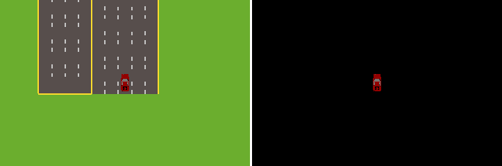

飞行器 RGB 传感器
===================

在 TSHub3D 的模拟环境中，飞行器搭载的 RGB 传感器为交通监控和自动驾驶研究提供了一个独特的视角。本节将详细介绍三种不同飞行模式的飞行器传感器效果。

飞行器垂直方向飞行
-----------------------

垂直飞行模式的飞行器可以在垂直方向上升和下降，从而改变拍摄角度和视野范围。随着飞行器上升，可观察到的区域范围扩大，但同时物体的细节将变得不那么清晰。相反，当飞行器下降时，可以捕获到更多的细节信息。

   飞行器垂直方向飞行效果。图中展示了飞行器上升和下降时视角的变化。

飞行器水平面飞行
-----------------------

在水平面飞行模式中，飞行器围绕路口进行旋转飞行，这使得我们能够从多个角度动态地观察到路口周围的情况。

   飞行器水平面飞行效果。图中显示了飞行器围绕路口旋转时捕捉到的连续画面。

飞行器跟车
-------------------

第三种模式是飞行器跟随特定车辆飞行，这样可以从空中密切观察和记录车辆的周围环境及其交互情况。

   飞行器跟车效果。图中展示了飞行器跟随车辆时的视角和捕捉到的信息。

通过这些传感器配置，TSHub3D 为研究者提供了一个全方位的交通监控工具，不仅能够从地面车辆的视角分析交通情况，还能从空中视角提供补充信息，有助于深入理解交通流和驾驶行为。
