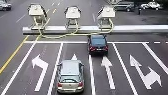
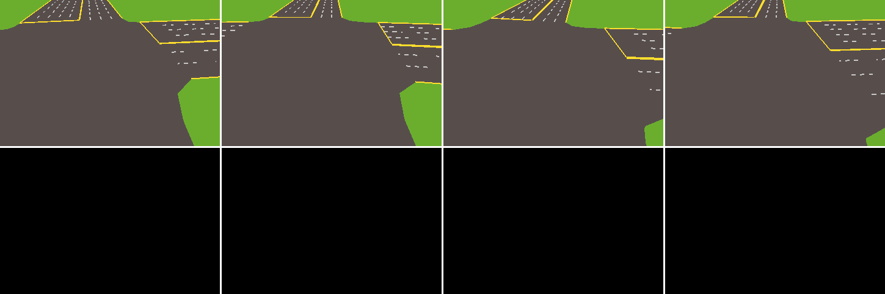

路口 RGB 传感器
=======================

TSHub3D 提供了全方位的路口监控功能，通过在十字路口的每个进入方向部署 **前拍** 和 **后拍** 传感器，从而实现全面的交通路口监控。以下是前拍和后拍传感器的详细介绍以及它们捕获的效果。

前拍传感器
--------------------

前拍传感器主要负责拍摄车辆的前部，能够有效地捕捉到车辆的前方情况以及车道的排队状况。下面的图片展示了一个前拍传感器的示例图像。

.. figure:: ../../../_static/tshub3d_sensors/junction/junction_front_example.png
   :alt: 前拍传感器示例
   :align: center
   :figwidth: 75%

   前拍传感器示例。图中显示了车辆的前部以及车道的排队情况。

接下来，我们看到的是 TSHub3D 中前拍传感器捕获的动态效果。这些图像可以用于交通监控分析，也可以作为自动驾驶系统模型训练的标签数据。

.. figure:: ../../../_static/tshub3d_sensors/junction/junction_front.gif
   :alt: 前拍传感器捕获效果
   :align: center

   前拍传感器捕获效果。图中展示了四个不同方向的前拍传感器捕获的场景和车辆信息。

后拍传感器
--------------------

后拍传感器则是专注于捕捉车辆的尾部，这对于判断车辆行驶方向（直行或转弯）非常有帮助。同时，后拍传感器也能够观测到路口对面车道的交通状况。以下是后拍传感器的示例图像。

   后拍传感器示例。图中显示了车辆的后部以及路口对面车道的排队情况。

下面的动态图展示了 TSHub3D 中后拍传感器捕获的效果。与前拍传感器类似，后拍传感器也提供了全方位的监控视角。

   后拍传感器捕获效果。图中展示了四个不同方向的后拍传感器捕获的完整场景和车辆信息。

通过结合前拍和后拍传感器，TSHub3D 能够提供一个十字路口全面的交通监控解决方案，这对于交通流量分析、事故预防以及自动驾驶算法的开发具有重要意义。