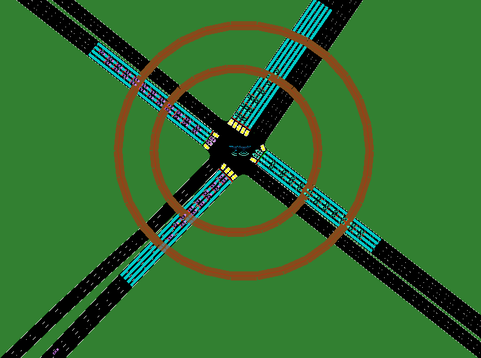
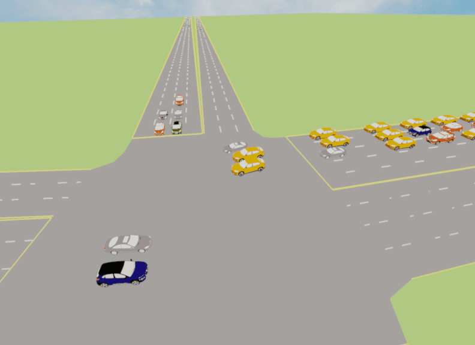

TransSimHub 3D 渲染
===========================

在本节中，我们将介绍如何使用 TransSimHub (TSHub) 来创建和渲染一个交通模拟的三维场景。我们的示例场景是一个 **标准的单十字路口**，其中包括：

* 三辆自动驾驶车辆（ego vehicle）；
* 两个飞行器（aircraft）：一个垂直飞行的飞行器和一个水平飞行的飞行器；

SUMO 可视化
--------------------

首先我们使用 SUMO 来展示十字路口的交通流动情况。如下图所示，你可以看到车辆在路口的通行情况，以及在路口上空进行飞行任务的两个飞行器。其中，水平飞行的无人机保持通信半径大小不变，而垂直飞行的无人机则根据高度变化调整其通信范围。

   SUMO模拟效果图。图中展示了十字路口的车辆通行以及无人机的飞行状态。

TSHub3D 可视化
----------------------

接下来，我们使用 **TSHub 3D** 来进行三维可视化。TSHub 3D 允许我们将传感器放置在场景中的任意位置，从而捕捉到不同角度的视觉效果。如下图所示，我们将传感器部署在路口上方并围绕路口渲染，以获取更加生动和真实的三维视觉效果。

   TSHub3D 可视化效果图。图中显示了传感器捕捉的三维场景，包括车道、车道线和路口的车辆。

在上述可视化中，我们可以清晰地看到每个车辆的位置，以及它们在模拟环境中的动态交互。TSHub 3D 的这些功能对于交通研究和自动驾驶系统的开发至关重要，它们提供了一个强大的工具来将交通场景进行 3D 的展示。
