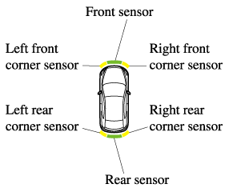

车辆 RGB 传感器
===================

在 TSHub3D 中，车辆是交通模拟的核心对象。每辆车都可以装备多个传感器，以从不同角度捕捉交通环境信息。本节将详细介绍如何在车辆上部署传感器，并展示它们捕获的效果。

车辆传感器概览
-------------------

每辆车配备有六个 RGB 传感器，分别覆盖车辆的前方、前左、前右、后方、后左和后右视角。以下图片展示了这些传感器在车辆上的布局。

   车辆传感器布局示例。图示中显示了六个传感器在车辆上的位置。

第一辆自动驾驶车辆的传感器效果
---------------------------------

第一辆自动驾驶车辆执行直行任务。其六个传感器记录了周围环境的全貌，包括车道线、交通信号和周围车辆。

.. figure:: ../../../_static/tshub3d_sensors/vehicle/vehicle_ego0_all.gif
   :alt: 第一辆车全景传感器效果
   :align: center

   第一辆车全景传感器效果。从六个不同角度展示了车辆直行时的周围环境。

针对同一辆车，我们还可以获取仅包含周围车辆的传感器数据，这对于自动驾驶算法的训练具有重要价值。

.. figure:: ../../../_static/tshub3d_sensors/vehicle/vehicle_ego0_vehicle.gif
   :alt: 第一辆车车辆识别传感器效果
   :align: center

   第一辆车车辆识别传感器效果。图中仅展示了其他车辆，去除了道路和背景信息。

第二辆自动驾驶车辆的传感器效果
---------------------------------

第二辆车在路口左转，其传感器记录了转弯过程中前方和后方的实时信息。

.. figure:: ../../../_static/tshub3d_sensors/vehicle/vehicle_ego1_all.gif
   :alt: 第二辆车全景传感器效果
   :align: center

   第二辆车全景传感器效果。展示了车辆左转时六个传感器捕捉到的详细环境信息。

下图展示了仅包含车辆的传感器数据，有助于进行更专注的行为分析和模式识别。

.. figure:: ../../../_static/tshub3d_sensors/vehicle/vehicle_ego1_vehicle.gif
   :alt: 第二辆车车辆识别传感器效果
   :align: center

   第二辆车车辆识别传感器效果。图中仅包含车辆信息，适用于交通行为分析。

第三辆自动驾驶车辆的传感器效果
---------------------------------

第三辆车的传感器效果与第二辆车相似，也是执行左转任务。

.. figure:: ../../../_static/tshub3d_sensors/vehicle/vehicle_ego2_all.gif
   :alt: 第三辆车全景传感器效果
   :align: center

   第三辆车全景传感器效果。图中展示了从六个角度捕捉的左转行驶过程。

最后，我们提供的是去除了道路和非车辆对象的传感器数据，便于进行目标检测和追踪。

.. figure:: ../../../_static/tshub3d_sensors/vehicle/vehicle_ego2_vehicle.gif
   :alt: 第三辆车车辆识别传感器效果
   :align: center

   第三辆车车辆识别传感器效果。图中仅展示了车辆，提供了清晰的目标视图。

通过这些传感器，TSHub3D 能够为自动驾驶车辆提供丰富的环境数据，这些数据对于自动驾驶系统的感知、规划和控制至关重要。
