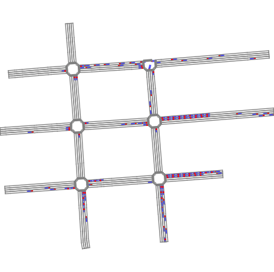
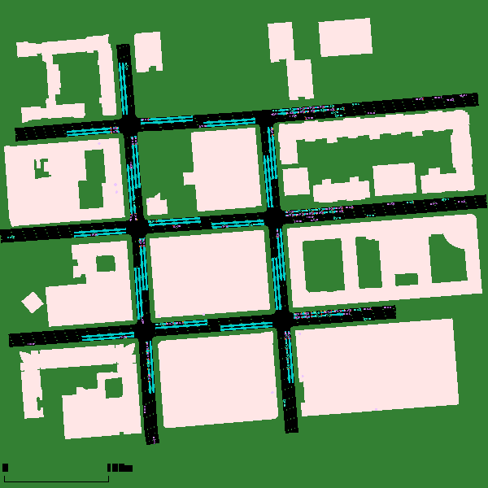
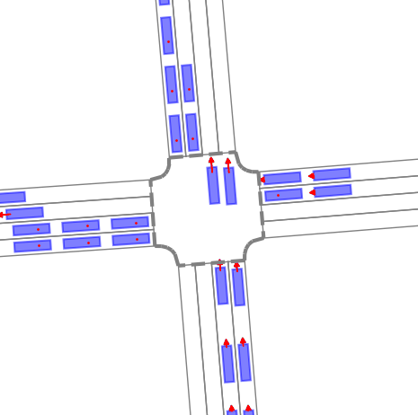
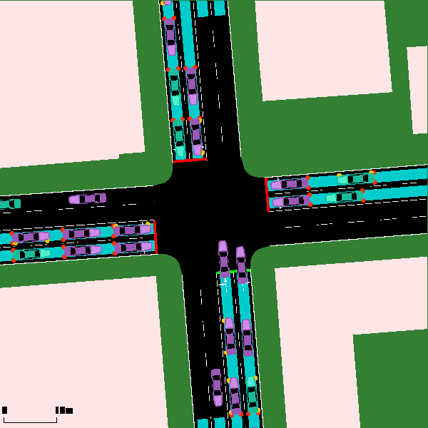
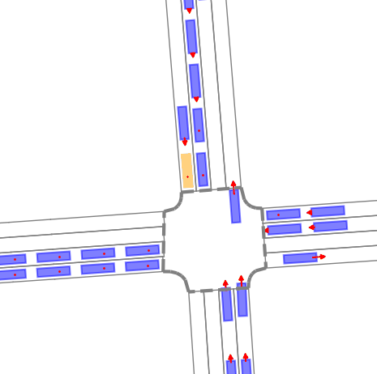
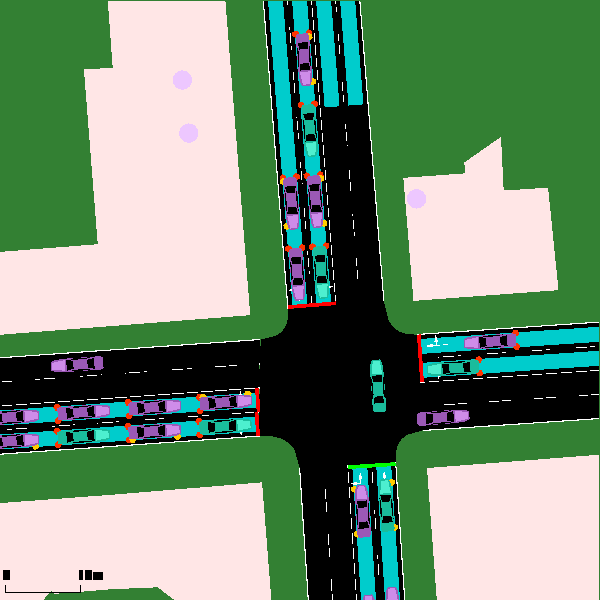

<!--
 * @Author: WANG Maonan
 * @Date: 2023-11-13 23:37:33
 * @Description: visualization in TsHub
 * @LastEditTime: 2023-11-14 00:10:20
-->
# Visualization for TransSimHub

TransSimHub 提供了

TransSimHub 共提供两种可视化的模式，分别是 `rgb` 和 `sumo_gui`。我们只需要

这里
```python
obs, reward, info, done = tshub_env.step(actions=actions)
fig = tshub_env.render(mode='rgb')
```


使用 `sumo_gui` 模式下，需要传入文件路径，结果会直接保存到指定的文件夹内。
```python
...

obs, reward, info, done = tshub_env.step(actions=actions)
fig = tshub_env.render(
    mode='sumo_gui',
    save_folder=image_save_folder
)
```

每一种可视化的模式支持三种方式，分别是全局渲染，局部路口渲染，和跟随车辆渲染。下面会逐个进行介绍。

## 全局渲染

<div style="display: flex; justify-content: space-between;">
    <div style="width: 50%;">
        
        <p style="text-align: center;">Image 1 Caption</p>
    </div>
    <div style="width: 50%;">
        
        <p style="text-align: center;">Image 2 Caption</p>
    </div>
</div>


## 局部路口渲染

<div style="display: flex; justify-content: space-between;">
    <div style="width: 50%;">
        
        <p style="text-align: center;">Image 1 Caption</p>
    </div>
    <div style="width: 50%;">
        
        <p style="text-align: center;">Image 2 Caption</p>
    </div>
</div>


## 跟随车辆渲染

<div style="display: flex; justify-content: space-between;">
    <div style="width: 50%;">
        
        <p style="text-align: center;">Image 1 Caption</p>
    </div>
    <div style="width: 50%;">
        
        <p style="text-align: center;">Image 2 Caption</p>
    </div>
</div>