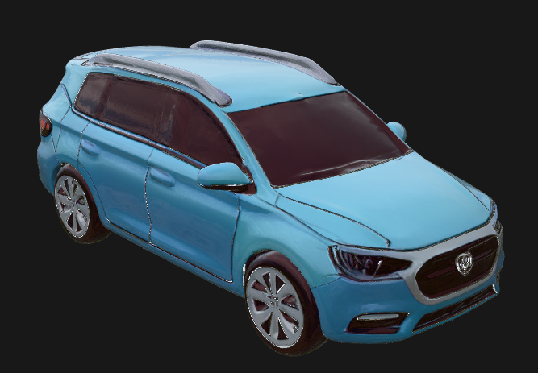
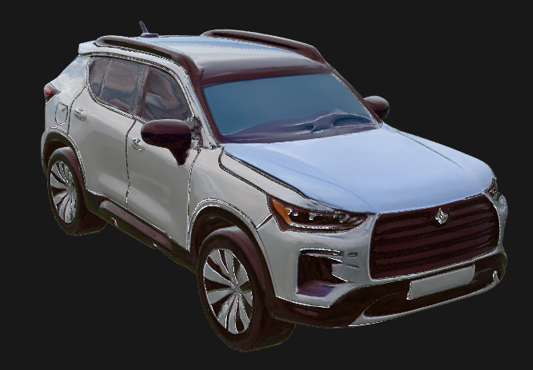
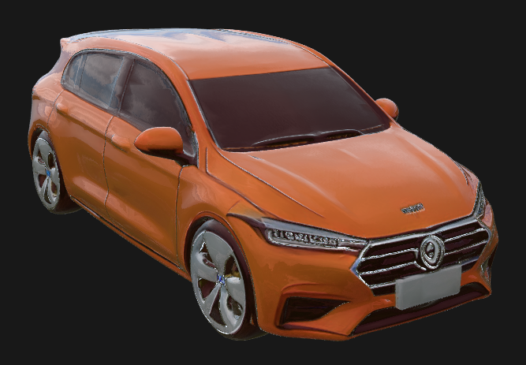
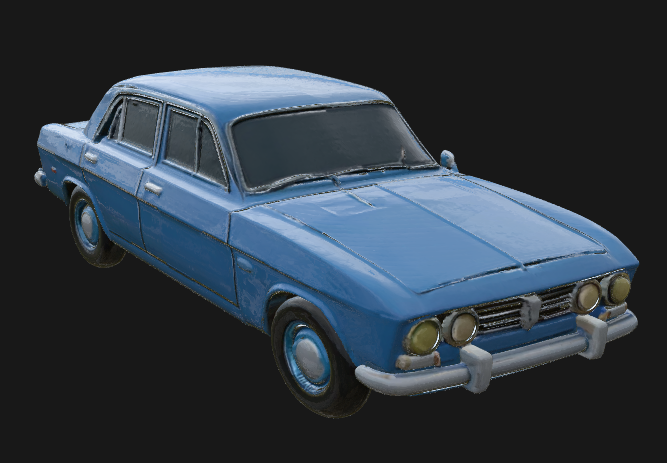
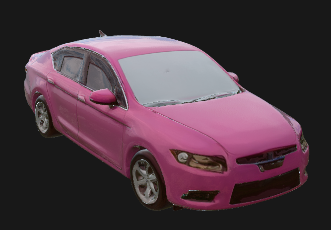
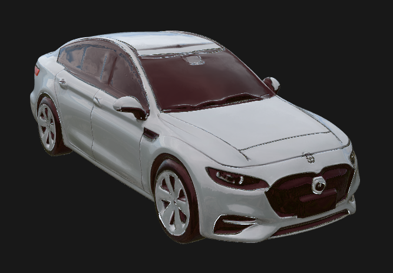
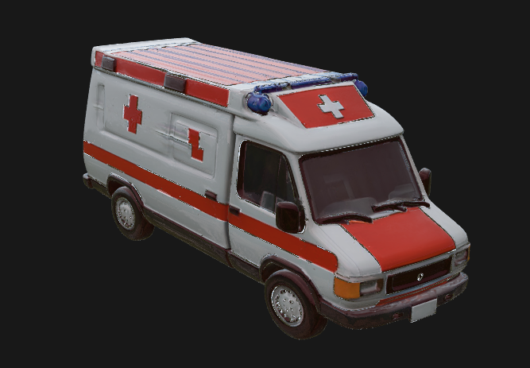
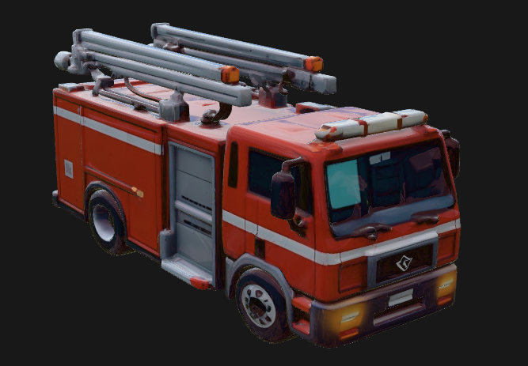
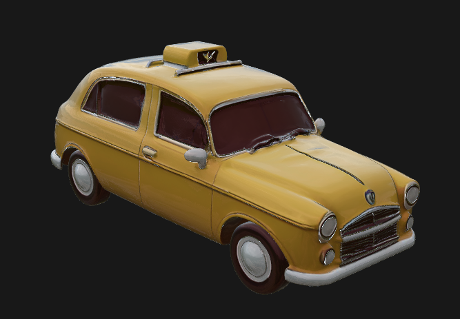

<!--
 * @Author: Maonan Wang
 * @Date: 2025-04-15 12:03:19
 * @LastEditTime: 2025-04-15 13:10:54
 * @LastEditors: Maonan Wang
 * @Description: 车辆模型介绍
 * @FilePath: /TransSimHub/tshub/tshub_env3d/_assets_3d/vehicles/README.md
-->
# TSHub3D 车辆类型介绍

下面是 TSHub3D 中用到的所有车辆类型的介绍。

## 车辆信息

### 常规车辆
| 车辆类型 (vClass) | 车辆长度 (length) | 3D 示例 | 说明 (info) |
| --- | --- | --- | --- |
| suv_blue | 5.0m |  | 蓝色 SUV |
| suv_grey | 5.0m |  | 灰色 SUV |
| suv_orange | 5.0m |  | 橙色 SUV |
| vehicle_blue | 5.0m |  | 蓝色轿车 |
| vehicle_pink | 5.0m |  | 粉色轿车 |
| vehicle_white | 5.0m |  | 白色轿车 |

### 特殊车辆
| 车辆类型 (vClass) | 车辆长度 (length) | 3D 示例 | 说明 (info) |
| --- | --- | --- | --- |
| emergency | 6.5m |  | - |
| fire engine | 7.1m |  | - |
| police | 5.0m |  | - |
| taxi | 5.0m |  | - |

## SUMO 车辆参数

更多关于车辆类型参数的默认设置，请参考 [SUMO Vehicle Parameter](https://sumo.dlr.de/docs/Vehicle_Type_Parameter_Defaults.html)。

---

# Project Vehicle Type Introduction

The following is an introduction to all vehicle types used in the TSHub3D.

## Vehicle Information

### Regular Vehicles
| Vehicle Type (vClass) | Vehicle Length (length) | 3D Example | Description (info) |
| --- | --- | --- | --- |
| suv_blue | 5.0m |  | Blue SUV |
| suv_grey | 5.0m |  | Grey SUV |
| suv_orange | 5.0m |  | Orange SUV |
| vehicle_blue | 5.0m |  | Blue Sedan |
| vehicle_pink | 5.0m |  | Pink Sedan |
| vehicle_white | 5.0m |  | White Sedan |

### Special Vehicles
| Vehicle Type (vClass) | Vehicle Length (length) | 3D Example | Description (info) |
| --- | --- | --- | --- |
| emergency | 6.5m |  | - |
| fire engine | 7.1m |  | - |
| police | 5.0m |  | - |
| taxi | 5.0m |  | - |

## SUMO Vehicle Parameters

For more information on the default settings of vehicle type parameters, please refer to [SUMO Vehicle Parameter](https://sumo.dlr.de/docs/Vehicle_Type_Parameter_Defaults.html).